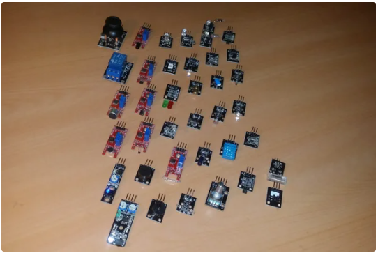

# Componentes basicos de un Sistema IoT

## Objetivos

>* Repasar los componentes básicos de un sistema IoT}
>* Explorar los componentes básicos que conforman el concepto de cosa.
>* Hacer las primeras pruebas con la placa de desarrollo ESP32
>* Investigar sobre los sistemas de desarrollo disponibles en el laboratorio.

## Referencias principales

1. Lección 2 **A deeper dive into IoT** ([link](https://github.com/microsoft/IoT-For-Beginners/blob/main/1-getting-started/lessons/2-deeper-dive/README.md)) del curso de Microsoft **IoT for Beginners** [[link](https://github.com/microsoft/IoT-For-Beginners)]

## Conceptos abordados

En la sesión de clase se abordaran los siguientes conceptos:
1. Componentes basicos de un Sistema IoT [[link]](https://udea-iot.github.io/UdeA_IoT-page/docs/sesiones/percepcion/sesion1)
2. Elementos de laboratorio [[link]](https://udea-iot.github.io/UdeA_IoT-page/docs/sesiones/percepcion/sesion2)
3. Arduino Framework [[link]](https://udea-iot.github.io/UdeA_IoT-page/docs/sesiones/percepcion/sesion3)
4. Comunicación serial [[link]](https://udea-iot.github.io/UdeA_IoT-page/docs/sesiones/percepcion/sesion4)

## Trabajo previo

Antes de empezar asegurese de tene instalado en su computador el siguiente software:
- [x] Arduino IDE (https://www.arduino.cc/)
- [x] Visual Studio Code (https://code.visualstudio.com/)
- [x] Platformio (Complemento de Visual Studio Code: https://platformio.org/)
- [x] Fritzing (https://fritzing.org/)
- [x] draw.io (https://www.drawio.com/)
- [ ] Mosquitto (https://mosquitto.org/)
- [ ] Mqtt explorer (http://mqtt-explorer.com/)
- [x] Node-red (https://nodered.org/)

* **Nota**: Los programas que no se encuentran seleccinados no son necesarios instalarlos por el momento. Para mas información puede consultar el siguiente [link](https://udea-iot.gitbook.io/introduccion-al-iot/pasos-previos/herramientas-necesarias/software)

## Trabajo de clase

### 1. Ejemplo de un sistema IoT

A continuación se muestra el diagrama de un sistema de control en tiempo real para jugar con un laberinto hecho en la universidad de Curtin (https://www.curtin.edu.au/):

En el siguiente video se puede observar el funcionamiento de dicho sistema:

### 2. Sistemas de desarrollo

El corazón de los sistemas IoT son las cosas. Estas, son las encargadas de permitir la interacción del sistema con el medio ambiente mediante la recolección, el procesamiento de los datos y las acciones de control sobre este. 

Para realizar labores de prototipado, se disponen de los elementos listados a continuación:

|Tipo|Ejemplos|
|---|---|
|Single-board Computer|<li> Raspberry Pi <li> BeagleBoard <li> Orange Pi <li> Intel Galileo |
|Development boards|<li> Arduino UNO <li> ESP8266 <li> ESP32 <li>ARDUINO NANO 33 BLE Sense Lite|

> Para conocer mas sobre estos elementos disponibles en el laboratorio consulte el siguiente [link](https://udea-iot.github.io/UdeA_IoT-page/docs/sesiones/percepcion/sesion2)

### 3. Sensores y actuadores

Mediante los sensores y los actuadores es como la cosa interactua con el entorno (ambiente). Existen numerosos kits de iniciación en el mercado. En el laboratorio se disponen de los siguientes modulos:
* Grove - Starter Kit v3
  
  

* 37 Sensor Kit - Elegoo
  
  

* Landzo 37 In 1 Sensors Kit For Arduino
  
  

> Para conocer mas sobre los sensores [link](https://udea-iot.github.io/UdeA_IoT-page/docs/sensores-actuadores/inventario-lab)

## Lista de avance

- [ ] 1. Ejemplo de un sistema IoT
- [ ] 2. Sistemas de desarrollo
- [ ] 3. Sensores y actuadores
- [ ] https://udea-iot.github.io/UdeA_IoT-page/docs/sensores-actuadores/sensores/intro

