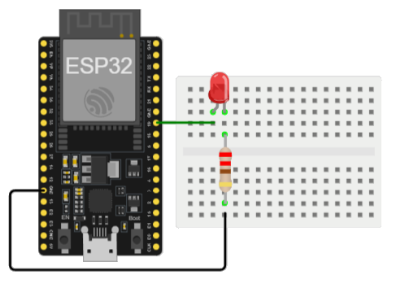
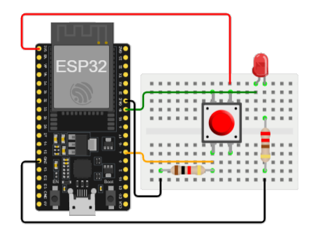
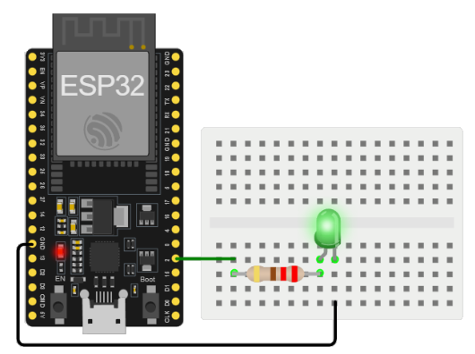
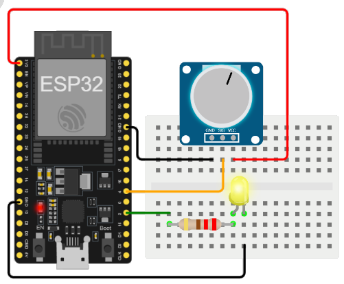

## Ejemplos

* https://github.com/UdeA-IoT/clases-IoT_capa-percepcion_2023-2/tree/main/dia3/esp32



https://wokwi.com/projects/391184511314874369

```C++
// Puertos
#define LED 19

// Inicializacion
void setup() {
  pinMode(LED, OUTPUT);
}

// Ciclo infinito
void loop() {
  digitalWrite(LED, HIGH);   
  delay(1000);                       
  digitalWrite(LED, LOW);    
  delay(1000);                      
}
```



https://wokwi.com/projects/391184895031851009

```C++
// Puertos
const int buttonPin = 4;         //  (GPIO4)
const int ledPin =  19;          //  (GPIO19)

// variables will change
int buttonState = 0;         

// Inicializacion
void setup() {
  pinMode(ledPin, OUTPUT);
  pinMode(buttonPin, INPUT);
}

// Ciclo infinito
void loop() {
  buttonState = digitalRead(buttonPin);

  if (buttonState == HIGH) {
    digitalWrite(ledPin, HIGH);
  } else {
    digitalWrite(ledPin, LOW);
  }
}
```



* https://wokwi.com/projects/391187150765388801
* https://docs.espressif.com/projects/esp-idf/en/v4.2/esp32/api-reference/peripherals/adc.html#:~:text=The%20ESP32%20integrates%20two%2012,channels%20(analog%20enabled%20pins).
* https://makeabilitylab.github.io/physcomp/esp32/pot-fade.html


```C++
// Puertos
const int ledPin = 2;    // GPIO2

// Inicializacion
void setup() {
  // nothing happens in setup
}

// Ciclo infinito
void loop() {
  for (int fadeValue = 0 ; fadeValue <= 255; fadeValue += 5) {
    analogWrite(ledPin, fadeValue);
    delay(30);
  }

  for (int fadeValue = 255 ; fadeValue >= 0; fadeValue -= 5) {
    analogWrite(ledPin, fadeValue);
    delay(30);
  }
}
```



https://wokwi.com/projects/391187529744912385

```C++
// Puertos
const int analogInPin = 4;            // GPIO4
const int analogOutPin = 2;           // GPIO2

// Variables de estado y control
int sensorValue = 0;        
int outputValue = 0;        

// Inicialización
void setup() {
  Serial.begin(9600);
}

// Ciclo infinito
void loop() {
  sensorValue = analogRead(analogInPin);
  outputValue = map(sensorValue, 0, 4095, 0, 255); // ADC de 12 bits
  analogWrite(analogOutPin, outputValue);

  Serial.print("sensor = ");
  Serial.print(sensorValue);
  Serial.print("\t output = ");
  Serial.println(outputValue);

  delay(2);
}
```

## Enlaces

1. https://makeabilitylab.github.io/physcomp/esp32/iot.html