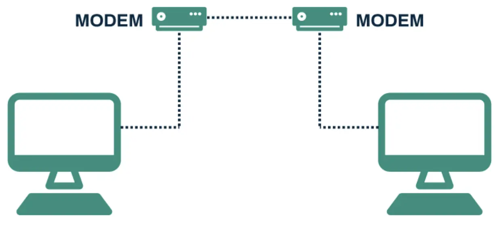
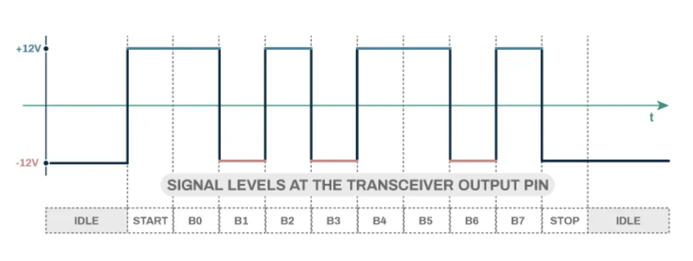

# RS-232

Se introdujo en 1960 para conectar computadores y modems denominados:
* **DTE**: Data Terminal Eqipment (computer)
* **DCE**: Data Communications Equipment (modem)

Este protocolo asíncrono utiliza líneas de control dedicadas para facilitar el intercambio de información entre el DTE y el DCE.

El RS-232 usa un voltaje positivo para la transmisión una señal cuyo nivel es bajo (0) y un voltaje negativo para la transmisión de un nivel logico alto (1).

La siguiente tabla resume los niveles logicos empleados.

|Nivel logico|Rango de voltaje|
|---|---|
|0|-18v to -5v|
|(Indefinido)|-5v to +5v|
|1|+5v to +18v|

La comunicación entre dos dispositivos usando RS-232 es simple. El dispositivo que envia almacena los datos en un buffer y los envia a traves de un cable destinado para esto (cable de datos), cuando le llegan los datos al receptor, entonces almacena estos datos en su buffer y una vez este se llena, el receptor puede proceder a leer los datos recibidos.

El hardware encargado de realizar la conversión de los datos de paralelo a serial (y viceversa) y asegura la transferencia serial de estos se conoce como **UART** (**Universal Asynchronous Receiver/Transmitter**) y viene integrado en los microcontroladores:

## Sobre la comunicación serial

Como el protocolo en serial asíncrono no tiene señal de reloj, tiene un conjunto de mecanismos que ayudan a garantizar la transferencia de los datos sin errores, estos son (en ingles):
* Data bits
* Synchronization bits
* Parity bits
* Baud rate

Cuando se envia la información, cada bloque (usualmente un byte) de datos es transmitido dentro de un paquete o trama de bits. Las tramas de bits se crean agregando bits de sincronización y paridad a los datos.

## Conexión 

Un bus serial consiste solamente de dos cables, uno para enviar los datos y otro para recibirlos. En un dispostivo con capacidad de transmisión serial tienen minimo un par de pines rotulados como **RX** para el receptor y **TX** para en trasmisor.

Cuando dos dispositivos se conectan, se hace de tal manera que el pin de transmisión del primero este conectado al pin de recepción del segundo y viceversa.

## API para comunicación serial de Arduino

En el API de Arduino ([link](https://www.arduino.cc/reference/en/)) se encuentran las principales funciones, clases y estructuras de datos que se usan para hacer programas en Arduino. En el link [Serial](https://www.arduino.cc/reference/en/language/functions/communication/serial/) la sección **Communication** se acceden a la documentación de todas las funciones para establecer comunicación serial.

> **Para profundizar**  
> Puede consultar las notas de clase donde se encuentra un resumen de las funciones mas comunes del API de Arduino para la comunicación serial en el siguiente [link](https://udea-iot.github.io/UdeA_IoT-page/docs/sesiones/percepcion/sesion4a)

La siguiente tabla resume de manera breve algunas de las principales funciones de la libreria serial.

|Función|Sintaxis|Descripción|
|---|---|---|
|`Serial.begin()`|`Serial.begin(speed)`|Configura la velocidad de transmisión serial (bits por segundo = baud).|
|`Serial.print()`   `Serial.println()`|`Serial.print(data)`  `Serial.println(data)`|Imprime los datos del puerto serial en formato ASCII, cuando se usa el método `.println(data)` se pone un salto de linea al final.|
|`Serial.available()`|`Serial.available()`|Devuelve la cantidad de bytes disponibles (pendientes por leer) en el puerto serial|
|`Serial.read()`|`Serial.read()`|Lee un dato a traves del puerto serial. Cuando no hay datos devuelve `-1`|
|`Serial.end()`|`Serial.end()`|Deshabilita la comunicación serial permitiendo que los pines `RX` y `TX` puedan ser usados como pines de entrada y salida `(I/O)`.|
|`Serial.write()`|`Serial.write(val)`   `Serial.write(str)`   `Serial.write(buf, len)`|Escribe un dato (o una cadena de datos) en formato binario al puerto serial|
|`Serial.flush()`|`Serial.flush()`|Espera hasta que la transmisión de los datos seriales que salen se complete|
|`Serial.peek()`|`Serial.peek()`|Permite lectura del puerto serial sin remover datos del buffer interno. |
|`Serial.SerialEvent()`|`Serial.SerialEvent()`|Funcion que se llama cuando hay datos disponibles en el puerto serial.|

## Ejemplos 

En construcción...
