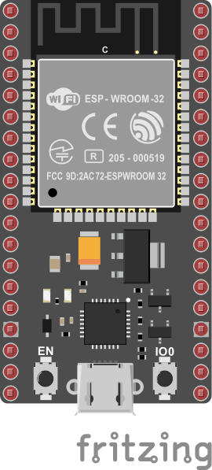

# Ejemplo de control de una ESP32 usando serial

El objetivo de esta sesión es explicar paso a paso como se construye una aplicación sencilla en la ESP que se comunique de manera serial con una aplicación que se esta ejecutando en un PC o RPi.

## Enuciado de la aplicación

Desarrolle una aplicación que permita encender y apagar un Led para el siguiente hardware:



La aplicación se conectara mediante el serial enviando dos comandos basicos para modificar el estado del led:

* **```h```**: Comando empleado para encender el Led.
* **```l```**: Comando empleado para apagar el Led.

## Prerequisitos

A continuación, se listan los ejemplos de software y hardware necesarios para llevar a cabo la implementación del proyecto.

### Hardware necesario

A continuación se muestra el harware necesario:
* **Placa ESP32**: NodeMCU ESP-32S

### Software necesario

La siguiente tabla muestra la lista de programas necesarios para la implmentación del problema:
* **Visual Studio Code**: Entorno de desarrollo.
* **Platformio**: Complemento de Visual Studio code para la programación de placas de desarrollo.
* **Librerias de python**: Estas se listan a continuación:
  
   |Libreria|Descripción|
   |---|---|
   |pyserial|Libreria para el manejo del puerto serial|
   |kiby|Libreria para el desarrollo de interfaces graficas|

* **NodeRed**: Para la creación de una interfaz grafica amigable.

## Configurando el entorno virtual

Para este caso, se proporciona el archivo [requirements.txt](requirements.txt) con el fin de configurar el entorno de desarrollo (para mas información sobre como hacerlo puede consultar el siguiente [link](../../herramientas/entorno-virtual-python/README.md)), por ahora resumimos el procedimiento a la ejecución de los siguientes comandos:

```
mkdir env_test
cd env_test
py -3 -m venv .venv
.venv\Scripts\activate
pip install -r requirements.txt
```
