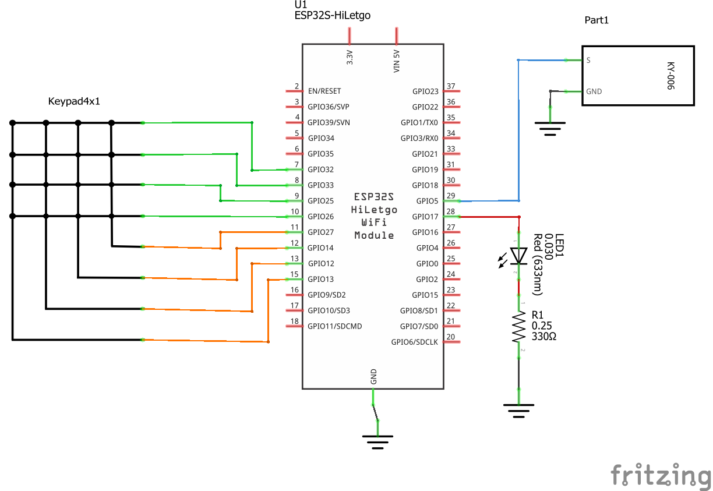
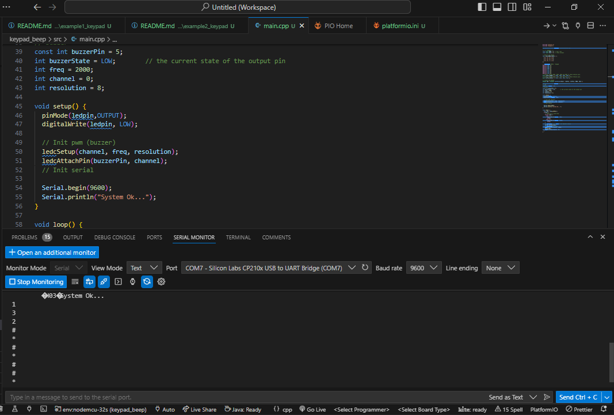

# Teclado matricial 4x4 con sonido y ESP32

## Resumen

Realizar una aplicación para el ESP32 que despliegue serialmente todas las teclas de un teclado matricial 4x4 escepto las que se asocian a las teclas **```#```** y **```*```**. El comportamiento cuando se precione alguna de las teclas será, encender y apagar el led que viene integrado con la tarjeta de tal manera que una de estas lo apaga, la otra lo prenda. Sin embargo, en este caso a adicional a lo hecho en el ejemplo anterior ([ejemplo1](../example1_keypad/)), se usará un buzzer para producir un sonido cada vez que se presione una tecla.

## Hardware

El archivo fritzing del proyecto es [esp32_keypad2.fzz)](esp32_keypad2.fzz)

### Componentes

La siguiente tabla muestra los componentes principales del circuito a montar:

|Componentes|Cantidad|Observaciones|
|---|---|---|
|ESP32|1|Placa ESP32 (Node-32s, YD-ESP32 o cualquier otra disponible en el laboratorio)|
|Teclado matricial de membrana|1|Disponible en el kit Elegoo ([datasheet](https://cdn.sparkfun.com/assets/f/f/a/5/0/DS-16038.pdf))|
|Passive Buzzer Module|1|	Elegoo 37 SENSOR KIT|
|Led|1|	Led Rojo|
|Resistencia $330\Omega$|1|	Resistencia limitadora de corriente del led|

### Esquematico



### Diagrama de conexión

#### Teclado matricial

|ESP32|Teclado matricial 4x4|
|---|---|
|```GPIO13```|```R1 (ROW1)```|
|```GPIO12```|```R2 (ROW2)```|
|```GPIO14```|```R3 (ROW3)```|
|```GPIO27```|```R4 (ROW4)```|
|```GPIO26```|```C1 (COL1)```|
|```GPIO25```|```C2 (COL2)```|
|```GPIO33```|```C3 (COL3)```|
|```GPIO32```|```C4 (COL4)```|

#### Buzzer pasivo

|ESP32|Buzzer pasivo|
|---|---|
|```GPIO5```|```S```|

#### Led

|ESP32|LED|
|---|---|
|```GPIO15```|Anodo del led|

Dependiendo de la placa empleada si el puerto asociado al led integrado no está ocupado puede cambiar en el código fuente el numero del puerto:
* **NodeMCU32s**: ```GPIO2```
* **YD-ESP32**: ```GPIO3```

## Software

El Proyecto generado por Platformio es **keypad_beep** y se encuentra en el siguiente directorio [keypad_beep](keypad_beep/)

### Placas

Las placas para las cuales se configuró el proyecto se resume en la siguiente tabla:

|Board|	Framework|
|----|----|
|	nodemcu-32s |	Arduino|
|	upesy_wroom |	Arduino|

### Librerias necesarias

Las librerias empleadas se muestran a continuación:

|#|	Libreria|	Observaciones|
|---|---|---|
|1|	Keypad	|Keypad library for Arduino ([link](https://github.com/Chris--A/Keypad))|

### Configuración en Platformio

El archivo resultante al configurar el proyecto en el platformio con los parametros de las tablas anteriormente mostradas se muestra a continuación:
    
```ini
; PlatformIO Project Configuration File
;
;   Build options: build flags, source filter
;   Upload options: custom upload port, speed and extra flags
;   Library options: dependencies, extra library storages
;   Advanced options: extra scripting
;
; Please visit documentation for the other options and examples
; https://docs.platformio.org/page/projectconf.html

[env:upesy_wroom]
platform = espressif32
board = upesy_wroom
framework = arduino
lib_deps = chris--a/Keypad@^3.1.1

[env:nodemcu-32s]
platform = espressif32
board = nodemcu-32s
framework = arduino
lib_deps = chris--a/Keypad@^3.1.1
```

### Código

El código de la aplicación (**main.cpp**) se muestra a continuación:

```C++
#include <Arduino.h>
#include <Keypad.h>

// ---------------- Entradas ---------------- //

// ---- Keypad ----
const byte ROWS = 4; // Four rows
const byte COLS = 4; // Three columns
    
// Define the Keymap
char keys[ROWS][COLS] = {
  {'1','2','3','A'},
  {'4','5','6','B'},
  {'7','8','9','C'},
  {'#','0','*','D'}
};
    
// Conections ESP32 - Keypad
#define ROW1 13
#define ROW2 12
#define ROW3 14
#define ROW4 27
#define COL1 26
#define COL2 25
#define COL3 33
#define COL4 32 
// Connect keypad ROW1, ROW2, ROW3 and ROW4 to these Arduino pins.
byte rowPins[ROWS] = { ROW1, ROW2, ROW3, ROW4 };
// Connect keypad COL0, COL1, COL2 and COL3 to these Arduino pins.
byte colPins[COLS] = { COL1, COL2, COL3, COL4 }; 
    
// Create the Keypad
Keypad kpd = Keypad( makeKeymap(keys), rowPins, colPins, ROWS, COLS );

// ---------------- Salidas ---------------- //
// Led
const int ledpin = 17;  
// buzzer
const int buzzerPin = 5;   
int buzzerState = LOW;        // the current state of the output pin
int freq = 2000;
int channel = 0;
int resolution = 8;

void setup() {
  pinMode(ledpin,OUTPUT);
  digitalWrite(ledpin, LOW);

  // Init pwm (buzzer)
  ledcSetup(channel, freq, resolution);
  ledcAttachPin(buzzerPin, channel);
  // Init serial

  Serial.begin(9600);
  Serial.println("System Ok...");
}
    
void loop() {  
  char key = kpd.getKey();
  if(key) { 
    // Check for a valid key.
    switch (key) {
      case '*':
        digitalWrite(ledpin, LOW);
        break;
      case '#':
        digitalWrite(ledpin, HIGH);
        break;
    }
    // Impresion de la tecla en el monitor serial
    Serial.println(key);
    // Generacion del beep
    ledcWriteTone(channel, 1500);
    delay(100);
    ledcWriteTone(channel, 0);
  }
}
```

## Pruebas

### Fisica

La salida en el monitor serial de platformio se encuentra c continuación:



### Simulación

La simulación del programa descargado se encuentra en ([link](https://wokwi.com/projects/391981965608341505))


## Referencias

* https://playground.arduino.cc/Main/KeypadTutorial/
* https://learn.adafruit.com/matrix-keypad
* https://randomnerdtutorials.com/arduino-membrane-keypad-tutorial/
* https://www.luisllamas.es/arduino-teclado-matricial/
* https://www.circuitbasics.com/how-to-set-up-a-keypad-on-an-arduino/
