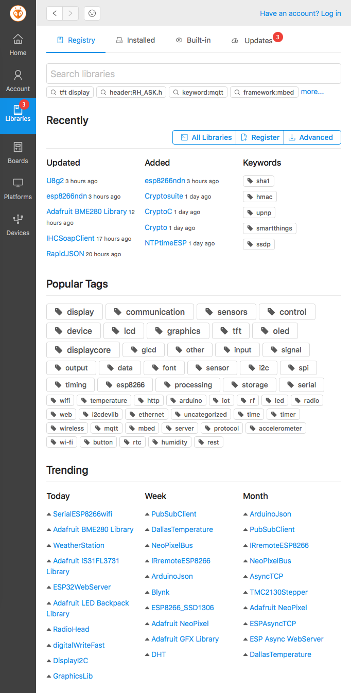
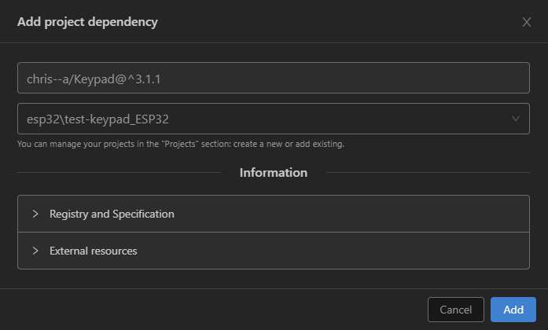
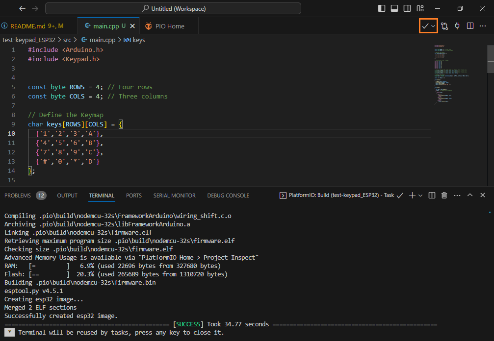
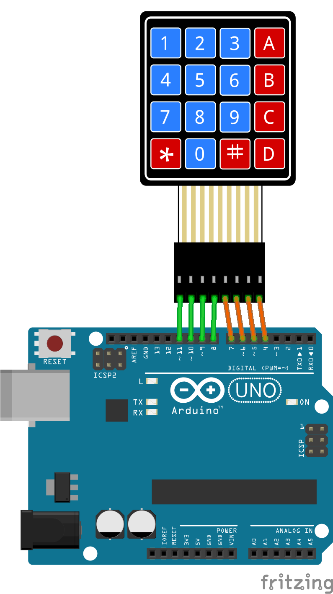
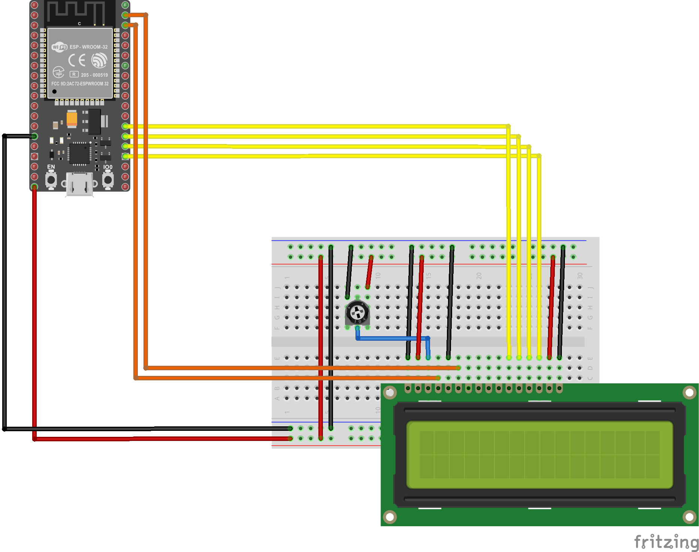
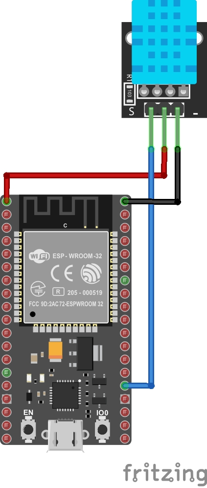

# Librerias y protocolos de comunicación entre los componentes de un nodo

## Objetivos

> * Aprender a instalar librerias de terceros en los IDEs en los IDEs Platformio y Arduino.
> * Aprender a usar las diferentes estructuras de datos y funciones de las librerias para el desarrollo de software que un sistema IoT.
> * Comprender los diferentes protocolos de comunicación empleados por los componentes básicos de un nodo.
>* Explorar algunos ejemplos de aplicación

## Referencias principales

1. Lección 3 **Interact with the phisycal world** ([link](https://github.com/microsoft/IoT-For-Beginners/blob/main/1-getting-started/lessons/2-deeper-dive/README.md)) del curso **IoT for Beginners** ([link](https://github.com/microsoft/IoT-For-Beginners)) de Microsoft.

## Conceptos abordados

1. Comunicación serial [[link]](https://udea-iot.github.io/UdeA_IoT-page/docs/sesiones/percepcion/sesion4/)
2. Comunicación usando One Wire (En construcción...)
3. Comunicación usando I2C (En construcción...)
4. Comunicación usando SPI (En construcción...)

## 1. Librerias

Cuando se adquiere una una impresora, el primer paso para que esta pueda usarse, consiste en obtener e instalar los drivers para que esta pueda funcionar correctamente en el sistema operativo. Normalmente, los fabricantes proporcionan los drivers de los dispositivos y por lo tanto, el procedimiento de poner en marcha el hardware consiste simplemente en ejecutar un simple instalador y listo; sin embargo, a veces se puede dar el caso en que el driver no existe y a menos que uno mismo lo cree, esta condenado a no poder usar dicho hardware y, generalmente, si esto ultimo pasa el resultado es que se quede con los crespos hechos a no ser que sea como Richard Stallman (Saint IGNUcius) (Ver: Cómo sería el mundo y la tecnología hoy en día sin el software libre y sin las ideas de Richard Stallman ([link](https://www.xataka.com/especiales/como-seria-mundo-tecnologia-hoy-dia-software-libre-ideas-richard-stallman)))

<p align="center">
  
</p>

Con el caso de los sistemas elecrónicos basados en microcontroladores sucede algo similar, cuando se desea que una aplicación use un hardware externo (sensor, actuador o memoria, por citar algunos casos), es necesario disponer de los drivers necesarios para permitir la interacción entre el firmware (programa descargado en el microcontrolador) y el hardware externo con el que este interactua.

Existen casos en los que el hardware externo no posee soporte, de modo que, se hace necesario para el programador el diseño y la programación de los programas (drivers) necesarios para su interacción y control; sin embargo, esta es una tarea dificil por que exige conocimiento de hardware, protocolos y detalles de bajo nivel relacionados con el diseño del hardware. Afortunadamente, una de las caracteristicas del proyecto Arduino radica en su filosofia **Open Hardware y Software** lo cual hace que gran candidad de hardware sea soportada para la plataforma Arduino.

Gracias a este soporte, es posible encontrar gran cantidad de bibliotecas prediseñadas que ocultan todos los detalles de bajo nivel para controlar el hardware, lo cual permite que el programador se centre en la logica del sistema en vez de en los detalles de bajo nivel.

### Agregando librerias

Exiten tutoriales en internet que explican muy bien como importar librerias portadas al API de Arduino, a continuación se listan estos enlaces:
1. **Installing an Arduino Library** de Sparkfun ([link](https://learn.sparkfun.com/tutorials/installing-an-arduino-library/all))
2. **All About Arduino Libraries** de Adafruit ([link](https://learn.adafruit.com/adafruit-all-about-arduino-libraries-install-use/arduino-libraries))
3. **Arduino Tips, Tricks, and Techniques** de Adafruit ([link](https://learn.adafruit.com/arduino-tips-tricks-and-techniques))
4. **Installing Libraries - Arduino IDE 1** de Arduino ([link](https://docs.arduino.cc/software/ide-v1/tutorials/installing-libraries))
5. **Installing Libraries - Arduino IDE 2** de Arduino ([link](https://docs.arduino.cc/software/ide-v2/tutorials/ide-v2-installing-a-library))
6. **Getting Started with VS Code and PlatformIO IDE for ESP32 and ESP8266 (Windows, Mac OS X, Linux Ubuntu)** de randomnerdtutorials ([link](https://randomnerdtutorials.com/vs-code-platformio-ide-esp32-esp8266-arduino/))
7. **Library Management** de Platformio ([link](https://docs.platformio.org/en/latest/librarymanager/index.html))

### Instalación de librerias en el Arduino IDE

El proceso de instalación de librerias en Arduino es sumamente facil, lo unico que se tiene que hacer es seguir las instrucciones de la pagina **Installing Libraries**. El procedimiento varia dependiendo de la version del IDE de Arduino que se tenga instalado, en los siguientes enlaces se puede consultar el procedimiento:
1. **Instalación de librerias para el IDE de Arduino (v1)** [[link]](https://docs.arduino.cc/software/ide-v1/tutorials/installing-libraries/)
2. **Instalación de librerias para el IDE de Arduino (v2)** [[link]](https://docs.arduino.cc/software/ide-v2/tutorials/ide-v2-installing-a-library/)


La siguiente imagen muestra el procedimiento de instalación de la biblioteca **Keypad** usando el gestor de librerias para el **IDE Arduino v2**:

<p align="center">
  
</p>

Despues de que se tiene instalada la biblioteca, es posible usar las funciones que esta tiene para lo cual, es necesario consultar la documentación. Por ejemplo, para la libreria **Keypad** la documentación se encuentra en el siguiente [repositorio](https://github.com/Chris--A/Keypad). En la siguiente figura se muestra el sketch del ejemplo que usa esta libreria:

<p align="center">
  
</p>


### Instalación de librerias en el Platformio

La instalación de librerias en el platformio se puede realizar de varias maneras. Para instalar librerias se accede al **Library manager** en la interfaz **PlatformIO Home** ([link](https://docs.platformio.org/en/stable/home/index.html))  dando click en el botón **Libraries** tal y como se muestra en la siguiente imagen:

<p align="center">
  
</p>

A continuación vamos a explorar de manera resumida como realizar el procedimiento completo cuando se usa el Platformio.
1. Crear y configurar el proyecto (si no lo recuerda puede consultar el siguiente [link](../1/README.md#platformio)). Supongamos que se creo un proyecto llamado **test-keypad_ESP32**. El archivo (**platformio.ini**) de configuración inicial se muestra a continuación:
   
   ```ini
   ; PlatformIO Project Configuration File
   ;
   ;   Build options: build flags, source filter
   ;   Upload options: custom upload port, speed and extra flags
   ;   Library options: dependencies, extra library storages
   ;   Advanced options: extra scripting
   ;
   ; Please visit documentation for the other options and examples
   ; https://docs.platformio.org/page/projectconf.html

   [env:nodemcu-32s]
   platform = espressif32
   board = nodemcu-32s
   framework = arduino
   ```
2. Usando el **Library manager** realizar los siguientes pasos:
   * Buscar la libreria por el nombre en el cuadro de texto del **Library manager**. Por ejemplo, si se quisiera instalar la libreria **Keypad** colocar su nombre en el cuadro de busqueda y luego seleccionar de la lista que aparece la libreria de interes:
  
   <p align="center">
   
   </p>

   * Despues de seleccionar la libreria dar click en **Add to Project** para agregarla a un proyecto.
   
   <p align="center">
   
   </p>

   * De la lista de proyectos que aparecen, seleccionar el proyecto en el cual se quiere agregar esta. (en nuestro caso, el proyecto se llamaba **test-keypad_ESP32** de modo que este es el que se seleccina)
  
   <p align="center">
   
   </p>
  
   Una vez el proceso de agregar las librerias necesarias se ha completado, el archivo **platformio.ini** queda actualizado con la información de las librerias agregadas:

   ```ini
   ; PlatformIO Project Configuration File
   ;
   ;   Build options: build flags, source filter
   ;   Upload options: custom upload port, speed and extra flags
   ;   Library options: dependencies, extra library storages
   ;   Advanced options: extra scripting
   ;
   ; Please visit documentation for the other options and examples
   ; https://docs.platformio.org/page/projectconf.html

   [env:nodemcu-32s]
   platform = espressif32
   board = nodemcu-32s
   framework = arduino
   lib_deps = chris--a/Keypad@^3.1.1   
   ```

Una vez hecho lo anterior, ya es posible empezar a trabajar en el archivo **main.cpp** usando las funciones de la biblioteca **Keypad** tal y como se muestra a continuación:

<p align="center">

</p>

> **Para profundizar** </br> En el tutorial **Installing SimpleFOClibrary with PlatformIO** ([link](https://docs.simplefoc.com/library_platformio)) se muestra claramente un ejemplo completo del proceso de instalación.

### Ejemplos

#### Teclado matricial

https://lastminuteengineers.com/arduino-keypad-tutorial/


En los siguientes ejemplos se muestran como usar un teclado matricial:

1. Instalación de la libreria **Keypad** para interactuar con un teclado matricial ([link](./librerias/keypad/example1_keypad/README.md)).
   
   <p align = "center">
   
   </p>

2. Uso de un teclado matricial en un ESP32. Cada vez que se presiona una tecla, se produce un sonido para indicar el evento. ([link](./librerias/keypad/example2_keypad/README.md)).
   
   <p align = "center">
   
   </p>

#### Display LCD

https://docs.arduino.cc/learn/electronics/lcd-displays/


En los siguientes sencillos ejemplos se ilustra el uso del LCD:

1. Contador simple usando el LCD ([link](./librerias/lcd/example1_lcd/README.md)).
   
   <p align = "center">
   
   </p> 

2. Sistema de acceso sencillo ([link](./librerias/lcd/example2_lcd/README.md)).
   
   <p align = "center">
   
   </p> 

#### Sensor de temperatura y humedad - DTH11

1. Sensado de temperatura y humedad usando el DTH11 (en construcción...)
   
   <p align = "center">
   
   </p>

## 2. Protocolos IoT comumente usados

Para permitir la comunicación entre dispositivos de usan diferentes tipos de protocolos los cuales se pueden clasificar en dos grandes grupos:

|Tipo|Caracteristicas|Ejemplos|
|---|---|---|
|Inalambricos|Facilitan la movilidad entre los dispositivos conectados; sin embargo, tienen limitantes en lo que respecta el consumo de potencia, el rango de cobertura y (comparativamente) las tasas de transferencia y throughput.|802.11 WiFi, Bluetooth, Low Power Wide Area Network (LPWAN), LoRa, SigFox|
|Alambricos|Superan algunas de las limitaciones de la tecnología inalámbrica, en particular las velocidades de datos y la eficiencia energética; sin embargo, puede requerir la instalación de una infraestructura significativa por lo que solo se adaptan bien a dispositivos estacionarios.|SPI, I2C, Ethernet, RS232|

## 3. Comunicación entre sensores

Actualmente disponemos de diferentes IC de memoria, sensores digitales, dispositivos de protección, fuentes de alimentación programables, potenciómetros digitales, IC de radiofrecuencia, etc. Todos necesitan comunicarse entre sí o con microcontroladores, microprocesadores, FPGA o ASIC. El propósito de estas comunicaciones entre dispositivos puede variar mucho. Puede ser que la programación extraiga información, proporcionando una señal para iniciar la ejecución de una acción.

En la actualidad, se disponen de una gran cantidad de circuitos integrados IC como: memorias, sensores digitales, potenciometros digitales y circuitos de radio frecuencia entre otros. Todos estos dispositivos realizan diferentes operaciones que dependen de la información que es enviada hacia y desde otros componentes digitales similares. 

Para permitir la comuniación de estos dispositivos entre si y con otros como los microcontrolaores se emplean difenrentes protocolos de comunicación los cuales se han definido por medio de estandares comunes con el fin de posibilitar la comunicación entre dispositivos sin depender del fabricante.

En esta parte se mostrará, de manera resumida, algunos de los diferentes tipos de protocolos de comunicación serial haciendo enfasis en los que se listan a continuación:
* RS-232 [[link]](RS_232/README.md)
* One Wire. [[link]](one-wire/README.md)
* I2C [[link]](I2C/README.md)
* SPI [[link]](SPI/README.md)

## Referencias

* https://learn.sparkfun.com/tutorials/serial-communication/all
* https://resources.altium.com/es/p/spi-versus-i2c-how-choose-best-protocol-your-memory-chips
* https://resources.altium.com/es/p/i2c-vs-spi-vs-uart-how-layout-these-common-buses
* https://www.analog.com/en/resources/analog-dialogue/articles/uart-a-hardware-communication-protocol.html
* https://resources.altium.com/p/serial-communications-protocols-introduction
* https://resources.altium.com/p/serial-communications-protocols-part-two-uart
* https://resources.altium.com/p/serial-communications-protocols-part-three-rs-232
* https://resources.altium.com/p/serial-communications-protocols-rs-485
* https://resources.altium.com/p/serial-communications-protocols-part-5-spi
* https://resources.altium.com/p/6-serial-communications-protocols-i2c
* https://resources.altium.com/p/7-serial-communications-protocols-1-wire
* https://resources.altium.com/p/serial-communications-protocols-can-and-lin
* https://resources.altium.com/es/p/spi-versus-i2c-how-choose-best-protocol-your-memory-chips
* https://hackmd.io/2oRlH_ogSWigu6HOc99TYw
* https://learn.sparkfun.com/tutorials/installing-an-arduino-library/all
* https://learn.adafruit.com/adafruit-all-about-arduino-libraries-install-use/arduino-libraries
* https://learn.adafruit.com/arduino-tips-tricks-and-techniques/arduino-libraries
* https://docs.arduino.cc/software/ide-v1/tutorials/installing-libraries
* https://docs.arduino.cc/software/ide-v2/tutorials/ide-v2-installing-a-library
* https://github.com/UdeA-IoT/actividad-4
* https://www.arduino.cc/reference/en/libraries/
* https://esp32io.com/tutorials/esp32-keypad
* https://deepbluembedded.com/esp32-keypad-lcd-example-arduino/
* https://docs.simplefoc.com/library_platformio
* https://randomnerdtutorials.com/vs-code-platformio-ide-esp32-esp8266-arduino/
* https://dronebotworkshop.com/platformio/
