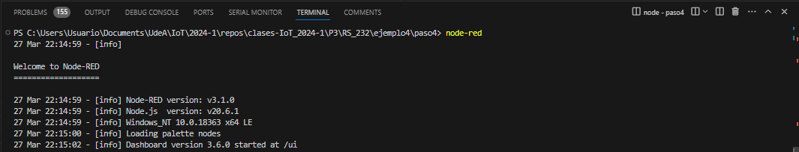
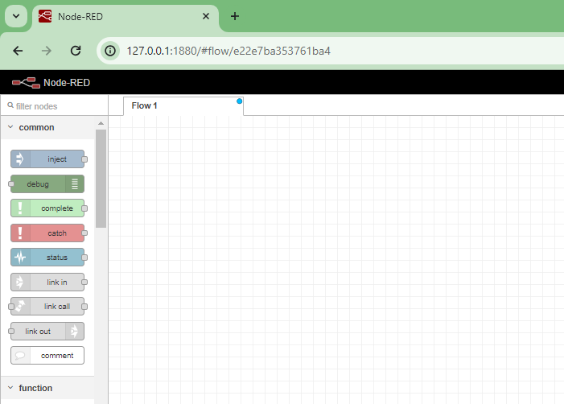
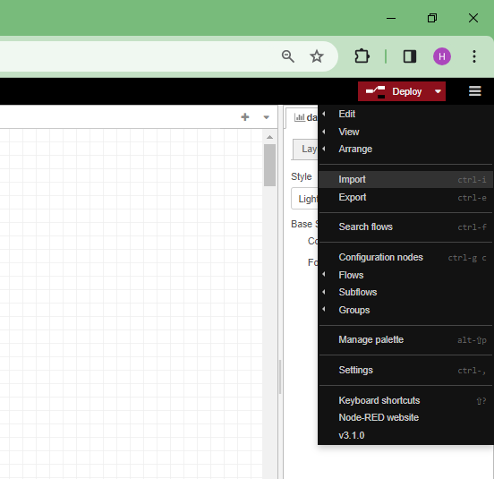
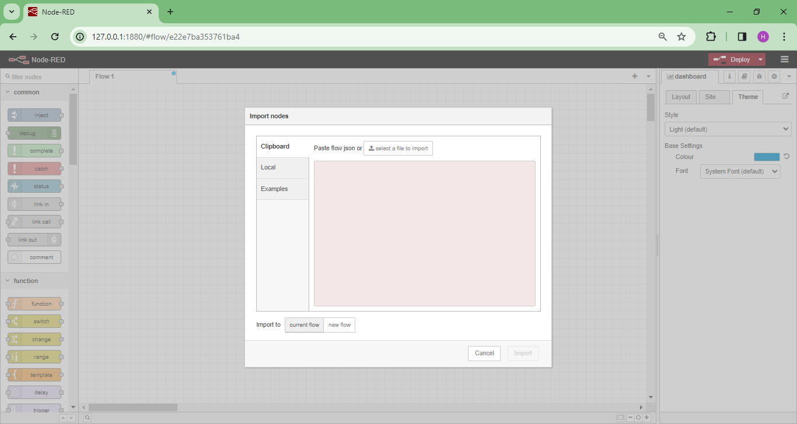
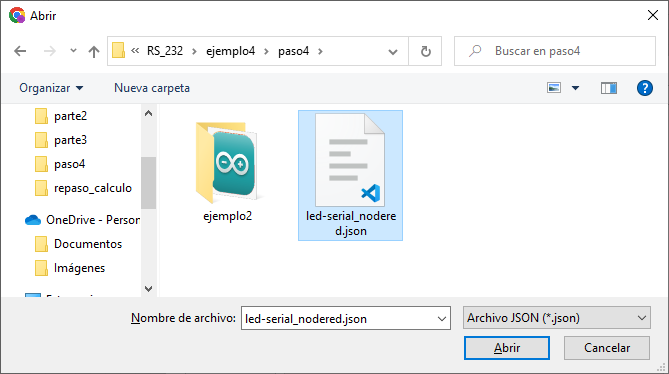
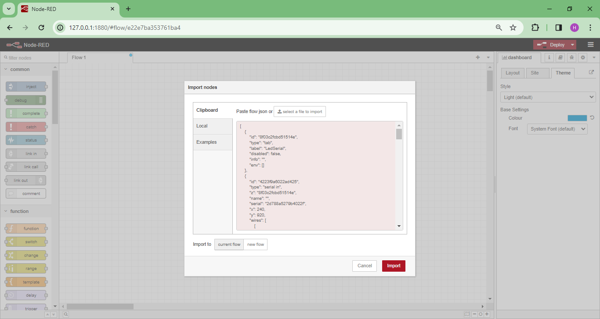
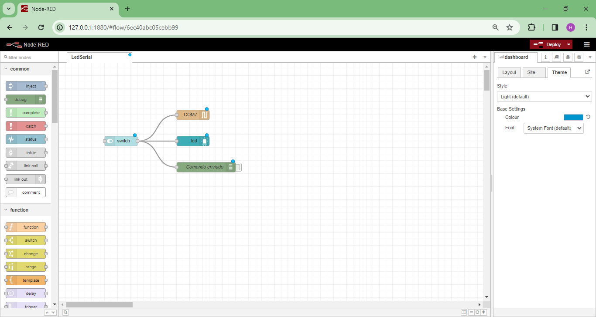
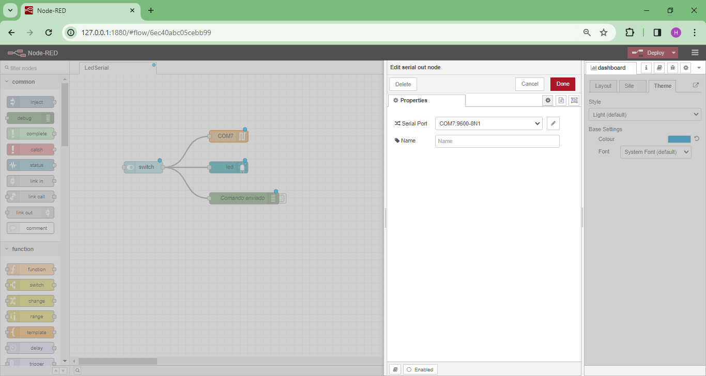
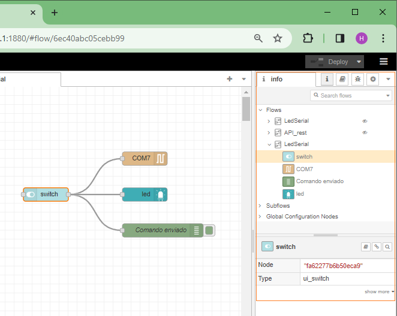

# Creación de la interfaz usando Node-RED

A continuación se describen los pasos para crear la aplicación del ejemplo usando Node-RED.

## Flujos

Los flujos se pueden crear arrastrando componentes o como en nuestro caso, importando el archivo JSON con los flujos (si este se tiene). En nuestro caso el archivo ya se tiene  ([led-serial_nodered.json](led-serial_nodered.json)) de modo que vamos a explicar como se importa:

1. Ejecutar el Node-RED ejecutando en la terminal el comando.
   
   ```
   node-red
   ```

   La siguiente figura muestra el procedimiento:

   <p align = "center">
   
   </p>

   Si todo esta bien en el browser en la URL: ``127.0.0.1:1880` se ejecutará la interfaz de Node-RED:

   <p align = "center">
   
   </p>

2. Importar el archivo JSON que describe el flujo ([led-serial_nodered.json](led-serial_nodered.json) en el caso) dando **click** en el icono de las tres barritas:
   
   <p align = "center">
   
   </p>

   Si todo esta bien aparecera la ventana para importar flujos:

   <p align = "center">
   
   </p>

   Luego dar click en boton **Select file to import** y elegir el flujo a importar:

   <p align = "center">
   
   </p>

   Si todo esta bien, aparecerá el contenido del archivo JSON en la ventana tal y como se muestra en la siguiente figura:

   <p align = "center">
   
   </p>

   Finalmente, seleccionar el boton **import** (de la figura anterior) cargara los flujos en la Interfaz de Node-RED:

   <p align = "center">
   
   </p>

3. Modificar las propiedades de cada uno de los **nodos** al dar **doble click** en el componente a editar. La siguiente figura muestra el caso para el **serial out node**:
   
   <p align = "center">
   
   </p>

   La pestaña **Info** (a la derecha) permite ver la información asociada al flujo en cuestion:

   <p align = "center">
   
   </p>


   


   
