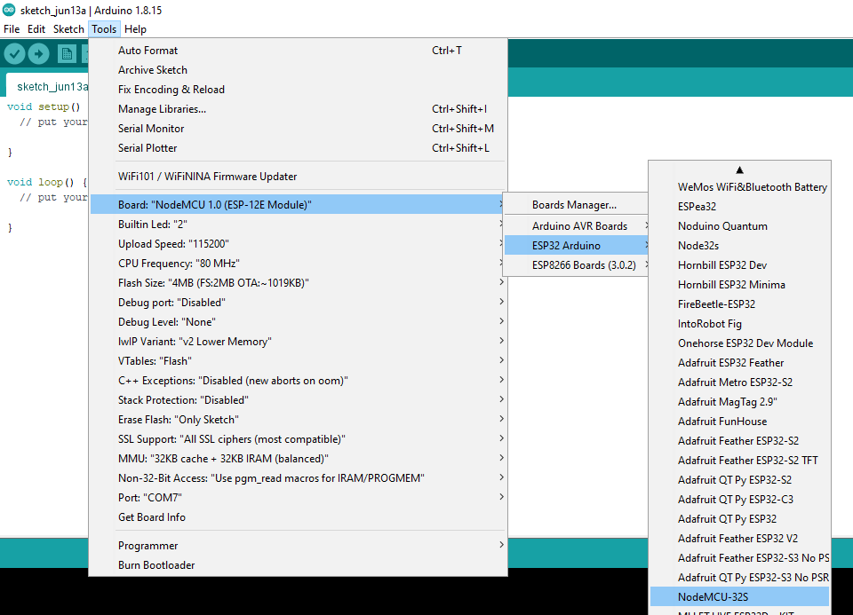
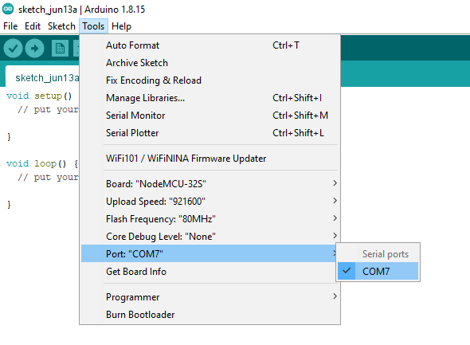
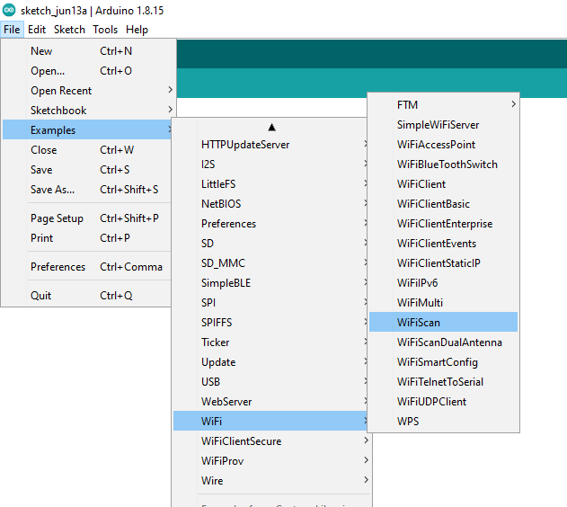
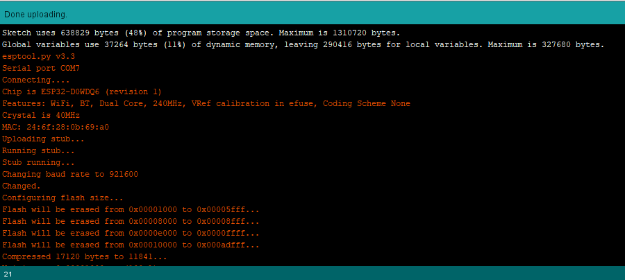
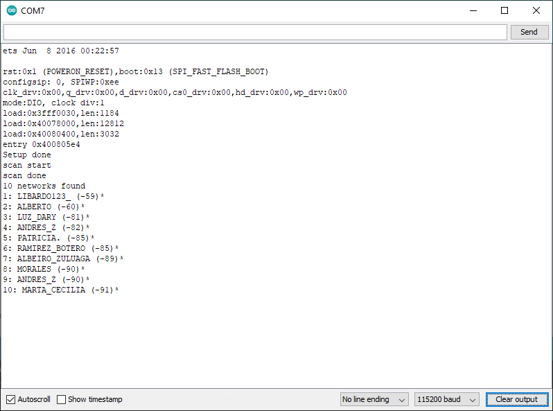
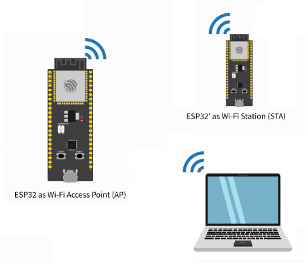
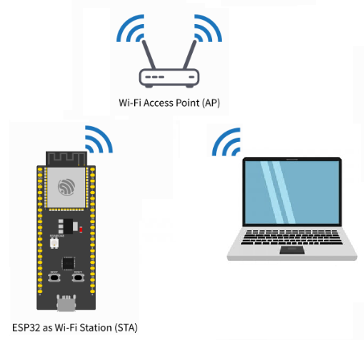

# Conexión wifi para el ESP32

## Antes de empezar

* https://randomnerdtutorials.com/getting-started-with-esp32/
* https://randomnerdtutorials.com/esp32-pinout-reference-gpios/
* https://randomnerdtutorials.com/installing-the-esp32-board-in-arduino-ide-windows-instructions/

## Arduino core for the ESP32

Como previamente se habia mencionado, el ESP32 es una evolución del ESP8266. En el laboratorio se cuentan con varios modulos [NodeMCU-32S](https://docs.ai-thinker.com/_media/esp32/docs/nodemcu-32s_product_specification.pdf). La siguiente lista resalta algunas referencias de utilidad si lo que se desea es sobre el ESP32:
* **ESP32 - Pagina del fabricante** ([link](https://www.espressif.com/en/products/socs/esp32))
* **ESP-IDF Programming Guide** ([link](https://docs.espressif.com/projects/esp-idf/en/latest/esp32/))
* **Arduino core for the ESP32** ([link](https://espressif.github.io/arduino-esp32/))

En nuestro caso vamos a hacer enfasis en el **Arduino core for the ESP32** ([link](https://espressif.github.io/arduino-esp32/)) que es donde se encuentra toda la información para programar el ESP32 haciendo uso del API de arduino ([link](https://docs.espressif.com/projects/arduino-esp32/en/latest/)). 

Antes de empezar es importante ver las librerias disponibles en el API las cuales se pueden ver en el siguiente [link](https://docs.espressif.com/projects/arduino-esp32/en/latest/libraries.html).


## Arduino core for the ESP32: Wi-Fi API

Como en nuestro caso, lo que nos interesa es analizar como se puede conectar el ESP32 a una red WiFi, la información mas relevante se encuentra en [Wi-Fi API](https://docs.espressif.com/projects/arduino-esp32/en/latest/api/wifi.html) asi que nos concentraremos en dar una vista rapida de este antes de poner algunos ejemplos.

Sobre el API, en la pagina se menciona:

> ### **About**
> The Wi-Fi API provides support for the 802 11b/g/n protocol driver. This API includes:
> * Station mode (STA mode or Wi-Fi client mode)ESP32 connects to an access point 
> * AP mode (aka Soft-AP mode or Access Point mode) Devices connect to the ESP32
> * Security modes (WPA, WPA2, WEP, etc).
> * Scanning for access points

Como punto de partida básico es bueno recordar los roles que puede tomar el ESP32 dentro de una red Wi-Fi:
* **Access Point (AP)**: En este modo, el ESP32 es configurado como un access point (AP) permitiendo la conexión entre los otros dispositivos (Stations) de la red.
 


* **Station (STA)**: En este caso, el ESP32 se conecta, como cualquier otro dispositivo, a la red Wi-Fi a traves de un Access Point.
 


## Prueba de conectividad

Antes de empezar, lo primero que debemos realizar es una prueba basica para verificar el Wi-Fi del modulo **NodeMCU-32S**. De modo que siga los siguientes pasos:
1. Abra el Arduino IDE.
2. Seleccione la placa (**Tools > Board > ESP32 Arduino > NodeMCU-32s**).



2. Conecte el modulo NodeMCU-32S al PC.

4. Seleccione el puerto.



5. En la sección de ejemplos (**examples**) busque los ejemplos relacionados con el **NodeMCU-32S** (**Examples for NodeMCU-32S**) y busque el que dice **WifiScan**,asi: **File > Examples > Wifi > WiFiScann**)


   
6. Compile y descargue el ejemplo a la tarjeta. A diferencia de las otras tarjetas, antes de proceder a la descarga del firmware, en este caso debe dejar presionado el boton **1OO** de la tarjeta y liberarlo apenas aparezca el mensaje ```Connecting...``` en los mensajes de la consola de descarga (Para mas infromación ver: [Getting Started with the ESP32 Development Board](https://randomnerdtutorials.com/getting-started-with-esp32/)):



7. Probar el ejemplo configurando la terminal serial en mismo valor que aparece en el codigo del programa (115200 para este caso). Si todo esta bien, saldrá en el monitor serial la información de las redes Wi-Fi disponibles tal y como se muestra a continuación:



## Librerias Wifi

Para hacer posible una conexión empleando Wifi, es necesario contar con un **Access Point (AP)**. Un **AP** es un dispositivo que permite la conexión de dispositivos Wi-Fi a una red cableada tal y como se muestra en la siguiente figura:


Para permitir la conexión de una placa Arduino a un red wifi se emplea el **Arduino WiFi**. Esto es posible gracias a la libreria **WiFi** ([link](https://www.arduino.cc/en/Reference/WiFi)) (la cual viene incluida en el Arduino IDE).
A continuación se muestran las clases de mayor uso de esta libreria:

### Clase WiFi 
La clase WiFi inicializa la biblioteca de ethernet y la configuración de red. La siguiente tabla muestra algunos de los principales métodos:

|Método|Descripción|Sintaxis|
|---|---|---|
|```WiFi.begin()```|Inicializa la configuración de red de la biblioteca WiFi y proporciona el estado actual|```WiFi.begin();``` <br> ```WiFi.begin(ssid);``` <br> ```WiFi.begin(ssid, pass);``` 
|```WiFi.disconnect()```|Desconecta la placa WiFi de la red actual.|```WiFi.disconnect();```|
|```WiFi.status()```|Devuelve el estado de la conexión (```WL_CONNECTED```, ```WL_CONNECTION_LOST```, ```WL_DISCONNECTED``` y ```WL_CONNECT_FAILED``` entre otros).|```WiFi.status();```|


### Clase IPAddress 

La clase ```IPAddress``` proporciona información sobre la configuración de la red. La siguiente tabla muestra los métodos de la clase ```Wifi``` que son empleados con esta clase:

|Método|Descripción|Sintaxis|
|---|---|---|
|```WiFi.localIP()```|Obtiene la dirección IP de la placa WiFi.|```WiFi.localIP();```|
|```WiFi.subnetMask()```|Obtiene la mascara de subred de la placa WiFi.|```WiFi.subnetMask();```|
|```WiFi.gatewayIP()```|Obtiene la dirección IP de la puerta de enlace de la placa WiFi.|```WiFi.gatewayIP();```|

### Clase Server

La clase Server crea servidores que pueden enviar y recibir datos de clientes conectados (programas que se ejecutan en otras computadoras o dispositivos). Esta clase, es la clase base de Wifi Server. Para su instanciación se emplea el siguiente constructor:

|Clase|Descripción|Sintaxis del constructor|
|---|---|---|
|```WiFiServer```|Crea un servidor que escucha las conexiones entrantes en el puerto especificado.|```Server(port);```|

A continuación se resumen algunos de los principales métodos asociados a esta clase.

|Método|Descripción|Sintaxis|
|---|---|---|
|```begin()```|Le dice al servidor que comience a escuchar las conexiones entrantes.|```server.begin();```|

### Clase Client

La clase client crea clientes que pueden conectarse a servidores y enviar y recibir datos.

|Método|Descripción|Sintaxis|
|---|---|---|
|```WiFiClient()```|Crea un cliente que puede conectarse a una dirección IP y un puerto de Internet especificados como se define en ```client.connect()```.|```WiFiClient();```|
|```connected()```|Determina si el cliente está conectado o no |```client.connected();```|

Debido al uso masivo del ESP8266, se creo una libreria WiFi (la cual trata de conservar la filosofia de la libreria original para Arduino) para esta plataforma. Para consultar mas sobre esta libreria puede dirigirse a la sección del [ESP8266WiFi library](https://arduino-esp8266.readthedocs.io/en/latest/esp8266wifi/readme.html) API de [ESP8266 Arduino Core](https://arduino-esp8266.readthedocs.io/en/latest/index.html).

Para mayor información puede consultar:
1. [Arduino WiFi library](https://www.arduino.cc/en/Reference/WiFi)
2. [ESP8266 Arduino Core’s](https://arduino-esp8266.readthedocs.io/en/latest/index.html)
3. [ESP8266 Arduino Core’s en español](https://esp8266-arduino-spanish.readthedocs.io/es/latest/#)

## Ejemplos - Parte 1

1. Crear una red local compuesta por los siguientes elementos:

   

   El papel de cada uno de los dispositivos involucrados se muestra a continuación:

   |Dispositivo | Rol|Descripción|
   |---|---|---|
   |ESP32 |Access point (AP)|Permitira creación de la red local interna para conectar a traves de Wifi todos los dispostivos pertenecientes a esta red|
   |Computador |Cliente|Será empleado como cliente con el fin de enviar peticiones al servidor (implementado en la ESP32)|
   |ESP32|Servidor (STA)| Ejecurara un servidor que permitira pender y apagar remotamente un led al responder a las peticiones recibidas desde el cliente|

   **Procedimiento**: El procedimiento se describe en el [ejemplo1](./ejemplo1/README.md)

2. Este es una variación del ejemplo anterior la cual consiste en agregar los dispositivos en una red ya disponible (como la del LIS por ejemplo). En este caso, solo se usará el ESP32 que hace de servidor y un pc (portatil y telefono movil) como cliente tal y como se muestra en la siguiente figura:
   
   

   El rol de los dispositivos implicados se muestra a continuación:

   |Dispositivo|Rol|Descripción|
   |---|---|---|
   |Computador |Cliente|Será empleado como cliente con el fin de enviar peticiones al servidor (implementado en la ESP32)|
   |ESP32|Servidor (STA)| Ejecurara un servidor que permitira pender y apagar remotamente un led al responder a las peticiones recibidas desde el cliente|

   **Procedimiento**: El procedimiento se describe en el [ejemplo 2](./ejemplo2/README.md)

3. En este ejemplo se replica el ejemplo **ESP32 Web Server – Arduino IDE** de Random Nerd Tutorials ([link](https://randomnerdtutorials.com/esp32-web-server-arduino-ide/)).
   
   **Procedimiento**: El procedimiento se describe en el [ejemplo 3](./ejemplo3/README.md)

4. Este ejemplo es una adaptación de un ejemplo de la guia **ESP32 Thing Hookup Guide** de Sparkfun ([link](https://learn.sparkfun.com/tutorials/esp32-thing-hookup-guide/)). Mas exactamente el ejemplo adaptado es el de la sección **Arduino Example: WiFi** ([link](https://github.com/UdeA-IoT/ejemplos-wifi/tree/main/ejemplo4))
   
   **Procedimiento**: El procedimiento se describe en el [ejemplo 4](./ejemplo4/README.md)

En todos los ejemplos anteriores, hemos visto el ESP32 funcionando como **Servidor**. A continuación veremos algunos ejemplos en los cuales el ESP32 toma un rol mas activo cuando es un cliente.

## Plataformas IoT

Hasta el momento hemos visto los siguientes temas:

* Conceptos basicos de programación de las sistemas de desarrollo Arduino UNO y ESP32.
* Algunos conceptos basicos entre sensores y actuadores.
* Comunicación serial.
* Comunicación inalambrica usando Wifi.

De los temas anteriormente vistos, es importante resaltar la importancia que juega la comunicación en una arquitectura IoT; asi mismo, que estas no son las unicas maneras de trabajar con datos, sin embargo, con saber por ahora esto basta.

Tal y como se muestra en la siguiente figura (tomada de IoT Engineering - [link](https://github.com/tamberg/fhnw-iot/tree/master/03))


En el modelo de referencia IoT, uno de los elementos claves son las plataformas IoT pues permiten almacenar y almacenar (entre otras cosas) datos de sensores. Para conectar las cosas con estas plataformas con las cosas, es importante conocer la forma como se lleva a cabo la comunicación y la interación establecida por estas la cual, generalmente es a traves de peticiones HTTP expuestas a traves de APIs.

Respecto al manejo de APIs, el siguiente documento se muestra un ejemplo tipico de un API ([cheatsheet_api](cheatsheet_api.pdf))

## APIs

Una interfaz de programación de aplicaciones (API) permite una conversación de software con otra.  Utiliza interacciones basadas en la web o protocolos de comunicación comunes y sus propios estándares patentados determinando qué tipo de datos, servicios y funcionalidad expone la aplicación a terceros.


Las API están diseñadas para ser consumidas mediante programación por otras aplicaciones y también pueden ser usadas por usuarios que desean interactuar con la aplicación manualmente. 

Los tres tipos más populares de estilos arquitectónicos API son:
* RPC
* SOAP
* REST

## API REST

Transferencia de Estado Representacional (REST) es un estilo arquitectónico escrito por Roy Thomas Fielding.

Una API de servicio web REST (API REST) es una interfaz de programación que se comunica a través de HTTP, por lo que utiliza los mismos conceptos que el protocolo HTTP:
* Solicitudes/respuestas HTTP
* Verbos HTTP
* Código de estado HTTP
* Encabezados/cuerpo HTTP


A continuación vamos a analizar tanto las solicitudes como las respuestas.

### Solicitudes de API REST

Las solicitudes de API REST son solicitudes HTTP en las que una aplicación (cliente) pide al servidor que realice una función.  Las solicitudes de API REST se componen de cuatro componentes principales:
* **Identificador uniforme de recursos (URI)**: También conocido como **localizador uniforme de recursos (URL)**, identifica qué recurso desea manipular el cliente. 
  
  

  Tal y como se resalta en la figura anterior, las URI tienen los siguientes componentes:
  * **Esquema**: especifica qué protocolo HTTP se debe usar, http o https.
  * **Autoridad**: consta de dos partes, a saber, host y puerto
  * **Ruta de acceso**: representa la ubicación del recurso, los datos u objeto, que se va a manipular en el servidor. 
  * **Consulta**: proporciona detalles adicionales sobre el ámbito, el filtrado o para aclarar una solicitud. 
  
* **Método HTTP:**: Empleado para comunicarse con los servicios web para los que se solicita la acción para el recurso dado. La asignación sugerida del método HTTP a la acción es la siguiente:
  
  |Método HTTP:|Acción|Descripción|
  |---|---|---|
  |POST|Crear (Create)|Crear un nuevo objeto o recurso.|
  |GET|lectura (Read)|Recuperar detalles de recursos del sistema.|
  |PUT|Actualizar|Reemplace o actualice un recurso existente.|  
  |PARCHE|Actualización parcial|Actualice algunos detalles de un recurso existente.|
  |DELETE|Eliminar (Delete)|Remover un recurso del sistema.|

* **Encabezado**: tienen el formato de pares **```nombre-valor```** separados por dos puntos (**:**); esto es, ```[nombre]: [valor]```. Podemos distinguir dos tipos de encabezados:
  *  **Encabezados de solicitud**: incluye información adicional que no esté relacionada con el contenido del mensaje.
  
     |Clave | Valor de ejemplo |Descripción |
     |---|---|---|
     |Autorización|DMFNCMFUDDP2YWDYYW básico|Proporciona credenciales para autorizar la solicitud|

  *  **Encabezados de entidad**: información adicional que describe el contenido del cuerpo del mensaje.
    
      |Clave | Valor de ejemplo |Descripción |
      |---|---|---|
      |Tipo de contenido|aplicación/ JSON|PEspecificar el formato de los datos en el cuerpo|
 
* **Cuerpo**: El cuerpo de la solicitud de API REST contiene los datos correspondientes al recurso que el cliente desee manipular. Las solicitudes de API REST que utilizan el método HTTP POST, PUT y PATCH suelen incluir un cuerpo lo que hace que cuerpo sea opcional dependiendo del método HTTP. 

### Respuestas API REST

Las respuestas de la API REST son respuestas HTTP que comunica los resultados de la solicitud HTTP de un cliente. La Respuesta REST API se componen de tres componentes principales:
* **Estado HTTP**: El código de estado HTTP ayuda al cliente a determinar el motivo del error y a veces puede proporcionar sugerencias para solucionar el problema. Los códigos de estado HTTP constan de tres dígitos, donde el primer dígito es la categoría de respuesta y los otros dos dígitos son asignados en orden numérico. Hay cinco categorías diferentes de códigos de estado HTTP:
   * **1xx - Informativo**: con fines informativos, las respuestas no contienen un cuerpo
   * **2xx - Éxito**: el servidor recibió y ha aceptado la solicitud
   * **3xx - Redirección**: el cliente tiene que tomar una acción adicional para completar la solicitud
   * **4xx - Error de cliente**: la solicitud contiene un error como sintáxis incorrecta o entrada no válida
   * **5xx - Error del servidor**: no se pueden cumplir las solicitudes válidas.
 
    Los codigos de estado mas comunes se muestran a continuación:

    |Código de Estado HTTP|Mensaje de estado|Descripción|
    |---|---|---|
    |200|Aceptar|La solicitud se realizó correctamente y normalmente contiene una carga útil (cuerpo)|
    |201|Creada|Se cumplió la solicitud y se creó el recurso que fue solicitado|
    |202|Aceptada|La solicitud ha sido aceptada para su procesamiento y está en proceso|
    |400|Solicitud no valida|La solicitud no se procesará debido a un error con la solicitud|
    |401|No autorizado|La solicitud no tiene credenciales de autenticación válidas para realizar la solicitud|
    |403|Prohibida|La solicitud ha sido entendida pero ha sido rechazada por el servidor|
    |404|No se encontró|No se puede cumplir la solicitud porque la ruta de acceso del recurso de la solicitud no se encontró en el servidor|
    |500|Error del servidor interno|No se puede cumplir la solicitud debido a un error del servidor|
    |503|El servicio no está disponible|No se puede cumplir la solicitud porque actualmente el servidor no puede manejar la solicitud|

* **Encabezado**: El encabezado de la respuesta proporciona información adicional entre el servidor y el cliente en el formato de par **```nombre-valor```** que está separado por dos puntos (**:**), ```[nombre]:[valor]```. Hay dos tipos de encabezados: 
   * **Encabezados de respuesta**: contiene información adicional que no está relacionada con el contenido del mensaje. Los encabezados de respuesta típicos para una solicitud de API REST incluyen:
    
     |Clave|Valor de ejemplo|Descripción|
     |---|---|---|
     |Set-Cookie|JSESSIONID=30A9DN810FQ428P; Ruta=/|Se utiliza para enviar Cookies desde el servidor|
     |Control de caché|Control de caché: max-edad=3600, público|Especificar directivas que DEBEN ser obedecidas por todos los mecanismos de almacenamiento en el caché|

   * **Encabezados de entidad**: son información adicional que describe el contenido del cuerpo del mensaje. Un encabezado de entidad común especifica el tipo de datos que son devueltos:

     |Clave|Valor de ejemplo|Descripción|
     |---|---|---|
     |Tipo de contenido|Aplicación/JSON|SEspecificar el formato de los datos en el cuerpo|
    
* **Cuerpo**: Contiene los datos asociados a la respuesta.

## Algunos APIs de utilidad

* https://learn.adafruit.com/adafruit-io/rest-api
* https://www.sparkfun.com/news/2379
* http://dweet.io/
* http://freeboard.io/

## Ejemplos - Parte 2

5. Realizar una petición Web empleando un microcontrolador como cliente como cliente.
   
   **Procedimiento**: El procedimiento se describe en el [ejemplo 5](./ejemplo5/README.md)

6. Enviar la información leida desde un potenciometro conectado al ESP32 a la plataforma [dweet.io](http://dweet.io/).
   
   **Procedimiento**: El procedimiento se describe en el [ejemplo 6](./ejemplo6/README.md)

## Actividad

Dirijase al siguiente [link](actividad/README.md) para realizar la actividad.

## Enlaces

* https://docs.espressif.com/projects/esp-idf/en/latest/esp32/
* https://www.espressif.com/en/products/socs/esp32
* https://docs.platformio.org/en/stable/boards/espressif32/nodemcu-32s.html
* https://docs.espressif.com/projects/arduino-esp32/en/latest/
* https://randomnerdtutorials.com/installing-the-esp32-board-in-arduino-ide-windows-instructions/
* https://docs.espressif.com/projects/espressif-esp-iot-solution/en/latest/index.html
* https://espressif.github.io/arduino-esp32/
* https://docs.espressif.com/projects/arduino-esp32/en/latest/libraries.html
* https://docs.espressif.com/projects/arduino-esp32/en/latest/libraries.html* 
* https://docs.espressif.com/projects/arduino-esp32/en/latest/api/wifi.html
* https://pygmalion.tech/tutoriales/robotica-basica/tutorial-camara-termica-amg8833/
* https://pygmalion.tech/tutoriales/
* https://esp32.com/
* https://www.espressif.com/en/products/socs/esp32/resources
* https://github.com/espressif
* https://blynk.io/
* https://docs.espressif.com/projects/arduino-esp32/en/latest/libraries.html
* https://github.com/UdeA-IoT/actividad-6
* https://github.com/tamberg/fhnw-iot
* https://www.networkworld.com/article/3133738/dweetio-a-simple-effective-messaging-service-for-the-internet-of-things.html
* https://www.learnrobotics.org/blog/nodemcu-dweet-io-freeboard-io-tutorial-for-iot/
* https://docs.iotify.io/temp/untitled-4
* https://github.com/Freeboard/freeboard
