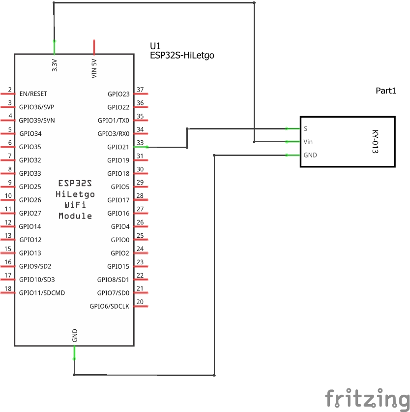
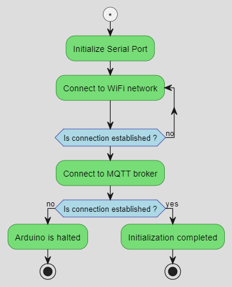
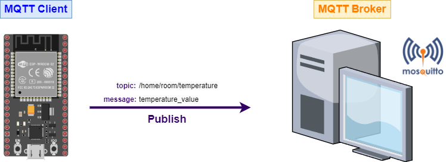
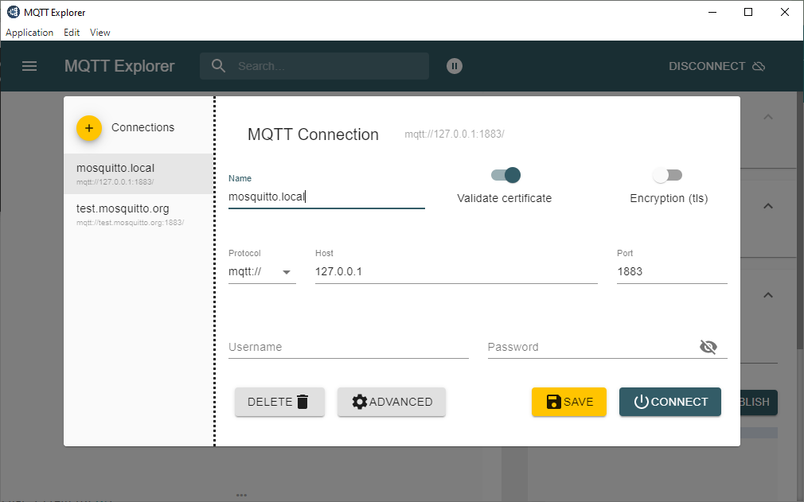
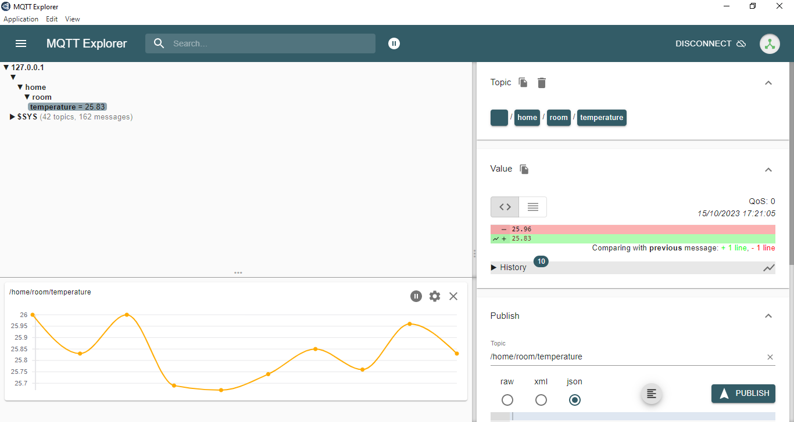

# Implementación de una aplicación MQTT

## Sobre MQTT

Dentro de los diferentes protocolos ([link](https://learn.adafruit.com/alltheiot-protocols)) usados en la industria IoT, el protocolo **MQTT (Message Queue Telemetry Transport)** ([link](https://mqtt.org/)) se ha convertido en uno de los mas populares. El protocolo MQTT (Message Queuing Telemetry Transport) es un protocolo diseñado para transferir mensajes mediante el uso de un modelo **publish and subscribe**. Mediante este modelo, es posible enviar mensajes a 0, 1 o multiples clientes.


Para permitir la comunicación entre los diferentes dispositivos, MQTT requiere del uso de un Broker central (tal y como se muestra en la figura de abajo (tomada de [link](https://learn.sparkfun.com/tutorials/introduction-to-mqtt/all))):


Tal y como se muestra en la figura anterior, los elementos de involucrados en una red MQTT son:
* **Broker**: Es el servidor encargado de distribuir la información entre los diferentes clientes conectados a la red.
* **Cliente**: Es el dispositivo que se conecta a la red MQTT a traves del broker para enviar y recibir información.

Los mensajes entre los clientes son direccionados por el broker por medio del **topic**. Para transferencia de mensajes en la red MQTT un cliente puede:
* **publish**: en este caso el cliente envia información a broker para que esta sea distribuida a los demas clientes interesados con base en el nombre del **topic**.
* **subscribe**: cuando se suscriben, los clientes indican al broker cuales son los **topic(s)** en los que estos se encuentran interesados, de manera que cualquier mensaje publicado por el broker es distribuido a los clientes que se encuentra **suscritos** (interesados) a dicho topic. Un cliente tambien puede **unsubscribe** a un tipico para parar de recibir mensajes desde el broker a traves de dicho topic.

## Elementos necesarios

Para trabajar con MQTT es necesario tener como minimo instalados los siguientes programas:
1. **El broker**: El software que implementa el broker debe estar instalado en uno de los dispositivos de la red MQTT (normalmente un PC, una RPi, cualquier dispositivo de borde o incluso en la nube) para hacer posible el redireccionamiento de los mensajes. 
2. **Clientes**: Los clientes pueden implentarse como aplicaciones de usuario (como **mosquito_pub**, **mosquito_sub** o **MQTT Explorer**) o pueden integrarsen a programas por medio de algun API MQTT (**Eclipse Paho** por ejemplo) mediante el uso de librerias en algun lenguaje de programación.

Antes de empezar implementar una red MQTT, asegurese de tener instalados los siguientes elementos:
1. Un **broker MQTT** en una maquina (el mosquitto ([link](https://mosquitto.org/download/)) fue la opción empleada en nuestro caso).
2. Un cliente MQTT para el envio y recepción de paquetes. En nuestro caso se instalaron:
   *  **mosquitto_pub** (Viene integrado en el broker MQTT Mosquitto).
   *  **el mosquito_sub** (Viene integrado en el broker MQTT Mosquitto).
   *  **MQTT Explorer**
3. Una libreria, en algún lenguaje de programación, para el desarrollo de clientes que usen MQTT. En nuestro caso se empleó la libreria **Eclipse Paho** ([link](https://projects.eclipse.org/projects/iot.paho))
   
Despues de realizar esto, es bueno verificar el correcto funcionamiento de las aplicaciones instaladas realizando una prueba sencilla en la que se verifique el funcionamiento del broker y los clientes.

## Implementación de clientes MQTT en las cosas

Por cosas hacemos referencia a los dispositivos que interactuan con el ambiente en la capa de percepción, en otras palabras las placas. En nuestro caso, como estamos trabajando con la placa **ESP32** es necesario instalar las librerias necesarias para que un ESP32 pueda funcionar como cliente en una red MQTT.

### Instalación en Arduino

El repositorio de la libreria **EspMQTTClient** se encuentra en el siguiente [link](https://github.com/plapointe6/EspMQTTClient). Para llevar a cabo la instalación de esta libreria en el IDE de Arduino, siga los siguientes pasos:
1. Abra el administrador de librerias: **Tools -> Manage Libraries...**
2. Digite en el campo de busqueda la palabra clave **pubsub**, seleccione la libreria **EspMQTTClient** e instalela:
      
   

3. Como esta libreria depende se otras dependencias, acepte la opcion que permite la instalación de todas las librerias (Install All) incluyendo las dependencias:

   


Si todo esta bien, ya esta todo listo para realizar programas que permitan la comunición de la ESP32 usando MQTT empleando como IDE el Arduino.

### Instalación en Platformio

La instalación en platformio se reduce simplemente a agregar la libreria MQTT (en nuestro caso se instalo la libreria **Arduino Client for MQTT** ([link](https://pubsubclient.knolleary.net/))) en el archivo de configuración **platformio.ini** (tal y como se ha hecho con las otras librerias). Este quedará de la siguiente forma: 

```ini
[env:nodemcu-32s]
platform = espressif32
board = nodemcu-32s
framework = arduino
lib_deps = knolleary/PubSubClient@^2.8
```

Sin embargo a continuación se explica como se realiza el procedimiento paso a paso (para profundizar ver la pagina *FSM Lecture 31- Adding arduino Library to project in platformIO* ([link](https://fastbitlab.com/fsm-lecture-31-adding-arduino-library-to-project-in-platformio/))):
1. Dar click en el boton **Libraries** y colocar en el cuadro de busqueda una palabra clave relacionada con la libreria de interes (en nuestro caso se coloco **mqtt** como palabra de busqueda). Luego, seleccionar de la lista de librerias que aparece aquella que deseamos instalar:
   
   
   
2. Agregar la libreria al proyecto.
   
   

3. En la lista de proyectos desplegadas, elegir el proyecto en el cual se va a realizar la instalación de la libreria.
   
   

4. Si todo sale bien, la libreria se agregará al archivo de configuración del proyecto **platformio.ini**
   
   

Si todo esta bien, ya es posible, para este proyecto, codificar programas que permitan la comunicación de la ESP32 por medio del protocolo MQTT usand platformio.

### Pasos para implementar el protocolo MQTT en el ESP32

Una vez instaladas las librerias necesarias en el IDE, el suguiente paso consiste en la codificación de la aplicación. A continuación, se detallan los pasos para la implementación de la aplicación:
1. Definir el hardware que se usara para la **cosa**, esto implica definir:
   * Lista de componentes.
   * El esquematico.
   * El diagrama de conexión.

2. Instalar en el IDE, las librerias externas necesarias para la aplicación: 
   
   |#|Libreria|Observaciones|
   |---|---|---|
   |1|PubSubClient|Libreria que implementa el protocolo MQTT|
   |...|...|...|
   |N|Libreria N|Información sobre la libreria|

3. Definir los parametros de configuración Wifi de la cosa:
   
   |Parametro|Valor|
   |---|---|
   |SSID|```"<SSID>"```|
   |PASSWORD|```"<PASSWORD>"```|

4. Definir los elementos de configuración asociados al protocolo MQTT de la **cosa**: 
   
   |Parametro|Valor|
   |---|---|
   |BROKER|```"<IP_BROKER>"```|
   |PASSWORD|```"<PASSWORD>"```|
   |ID|```"<ID_THING>"```|
   
5. Definir los topicos y los mensajes asociados a la **cosa** y determinar el rol de la **cosa** respecto al tópico.  
   
   |#|Topico|Mensaje|Descripción|Rol (S/P)|
   |---|---|---|---|---|
   |1|```topic1```|```estructura_mensaje1```|Decripción del comando asociado al ```topic1```|```S/P``` segun sea el caso|
   |2|```topic2```|```estructura_mensaje2```|Decripción del comando asociado al ```topic2```|```S/P``` segun sea el caso|
   |**...**|...|...|...|
   |N|```topicN```|```estructura_mensajeN```|Decripción del comando asociado al ```topicN```|```S/P``` segun sea el caso|

6. Crear las variables y objetos necesarios para la implementación de la aplicación y realizar la implementación de la inicialización (```setup()```) y de la logica de la aplicación (```loop()```):
   
   ```cpp
   #include <Wifi.h>
   #include <PubSubClient.h>
     
   /* ----- Puertos ----- */
   // Definicion de los pines
   ...
   

   /* ----- Wifi ----- */
   const char* ssid = "SSID-AP";   // name of your WiFi network
   const char* password = "PASS_AP"; // password of the WiFi network
   WiFiClient wifiClient;
 
   /* ----- MQTT ----- */
   const char* mqttBroker = "IP_BROKER"; // IP address of your MQTT 
   const char *ID = "id_thing";  // Name of our device, must be unique
   // Topics
   const char *topic1 = "topic1_name"; 
   const char *topic2 = "topic2_name";  
   // Setup MQTT client
   PubSubClient mqttclient(wclient); 

   /* ----- Variables del programa ----- */
   // Variables y constantes asociadas al programa
   const int PORT_SPEED = 9600; 
   ...

   
   /* ----- Helper Functions ----- */   
  
   // --- Ports Setup ---
   void setup_ports() {
     // Codigo de inicialización de los puertos
     ...
   }

   // --- MQTT ---
   void mqttConnect() {
     // Loop until we're reconnected
     while (!mqttClient.connected()) {
       Serial.print("Attempting MQTT connection...");
       if (mqttClient.connect(ID)) {
         Serial.println("OK");
         // Topic(s) subscription
         mqttClient.subscribe(topic1);
         ...

       } 
       else {     
         // Retry connection
         Serial.print("failed, rc=");
         Serial.print(mqttClient.state());
         Serial.println(" try again in 5 seconds");
         delay(5000);    
       }
     }
   }

   // Subscription callback 
   void callback(char* topic, byte* message, unsigned int length) {
     // Code...
     ...
   }
  
   // --- Wifi ---
   
   // Wifi conection
   void setup_wifi() {
     Serial.print("\nConnecting to ");
     Serial.println(ssid);

     WiFi.begin(ssid, password); // Connect to network

     while (WiFi.status() != WL_CONNECTED) { // Wait for connection
       delay(500);
       Serial.print(".");
     }

     Serial.println();
     Serial.println("WiFi connected");
     Serial.print("IP address: ");
     Serial.println(WiFi.localIP());
   }

   // 
   void init_XXX() {
     // Codigo de inicializacion de componente XXX
   }
   
   /* ----- Main funtions ----- */
   ...

   
   // ----
   void setup() {
     // Setup ports
     setup_ports();
     // Serial setup
     Serial.begin(PORT_SPEED);
     // Setup wifi
     setup_wifi();

     // MQTT setup
     mqttClient.setServer(mqttBroker, 1883);
     mqttClient.setCallback(callback);
   }
  
   // loop
   void loop() {
    // Check if we are still connected to the MQTT broker
    if (!mqttClient.connected()) {
      mqttConnect();
    }
    // Let PubSubClient library do his magic
    mqttClient.loop();

    // Publish based on events
    //Code...
    ...
    
   }    
   ```

Para saber como implementar un cliente en la ESP32, es necesario consultar la documentación del API **EspMQTTClient** en el siguiente [link](https://github.com/plapointe6/EspMQTTClient).

Si desea profundizar un poco sobre esto, le recomendamos mirar los siguientes tutoriales:
* **Curso de MQTT** ([link](https://www.luisllamas.es/curso-mqtt/))
* **MQTT Protocol Guide: Everything You Need to Know** ([link](https://cedalo.com/blog/complete-mqtt-protocol-guide/))
* **Getting Started with MQTT and Arduino** ([link](https://cedalo.com/blog/mqtt-and-arduino-setup-guide/))
* **Step-by-Step Tutorial on Enabling MQTT on ESP32 Module** ([link](https://cedalo.com/blog/enabling-esp32-mqtt/))
* **ss**

### Caso de prueba

Supongamos que se nos da el siguiente problema: Se desea implementar un programa en una ESP32 que mida la temperatura y que envie este valor, de manera periodica, cada 5 segundos empleando MQTT.

1. **Hardware**:
   
   * **Lista de componentes**:
   
     |#|Elemento|Cantidad|
     |--|--|--|
     |1|ESP32|1|
     |2|KY-013 ANALOG TEMPERATURE SENSOR MODULE|1|

   * **Esquematico**:

     

   * **Conexión**:
     
     

2. **Librerias**: 
   
   |#|Libreria|Observaciones|
   |---|---|---|
   |1|PubSubClient|Libreria que implementa el protocolo MQTT|

3. **Parametros WiFi**:
   
   |Parametro|Valor|
   |---|---|
   |SSID|```"IoT"```|
   |PASSWORD|```"1245678h"```|

4. **Parametros MQTT**: 
   
   |Parametro|Valor|
   |---|---|
   |BROKER|```"192.168.43.55"```|
   |ID|```"UdeA_thing-001"```|
   
5. **Topicos**.  
   
   |#|Topico|Mensaje|Descripción|Rol (S/P)|
   |---|---|---|---|---|
   |1|```/home/room/temperature```|```temp```|```temp``` corresponde al valor de la tempertatura enviado|```P```|
   
6. **Código**: Los diagramas mostrados a continuación (tomados de [link](https://cedalo.com/blog/mqtt-and-arduino-setup-guide/)) resume la implementación del codigo que sera codificado en el ESP32:

   **Inicialización**:

   

   **Loop**:

   

A continuación, se muestra el código asociado a la implementación para el ESP32:

**Archivo de configuración**: platformio.ini

```ini
[env:nodemcu-32s]
platform = espressif32
board = nodemcu-32s
framework = arduino
lib_deps = 
	knolleary/PubSubClient@^2.8
```

**Archivo principal**: main.cpp

```cpp
#include <Arduino.h>
#include <Wifi.h>
#include <PubSubClient.h>
     
/* ----- Puertos ----- */
const int THERMISTOR_PIN = 33; 

/* ----- Caracteristicas del Termistor -----*/
const double VCC = 3.3;             // NodeMCU on board 3.3v vcc
const double R2 = 10000;            // 10k ohm series resistor
const double adc_resolution = 4096; // 12-bit adc

const double A = 0.001129148;   // thermistor equation parameters
const double B = 0.000234125;
const double C = 0.0000000876741; 


/* ----- Wifi ----- */
const char* ssid = "IoT";   // name of your WiFi network
const char* password = "1245678h"; // password of the WiFi network
WiFiClient wClient;
 
/* ----- MQTT ----- */
const char* mqttBroker = "192.168.43.55"; // IP address of your MQTT 
const char *ID = "UdeA_thing-001";  // Name of our device, must be unique
// Topics
const char *topic = "/home/room/temperature"; 

// Setup MQTT client

PubSubClient mqttClient(wClient); 

/* ----- Variables del programa ----- */
// Variables y constantes asociadas al programa
const int PORT_SPEED = 9600; 
const int BUF_SIZE = 100;
int adc_value;
double currentTemp;

const long intTimer = 5000;    // Intervalo de publicación (5 seg)
unsigned long prevTimer = 0;   // Marca de tiempo anterior (t - 1)
unsigned long actualTimer = 0; // Marca de tiempo actual (t)
char message[BUF_SIZE];


/* ----- Helper Functions ----- */   
 
float get_Temperature(int acd_value){
  double Vout, Rth, temperature;
  adc_value = adc_resolution - acd_value + 0.5; // switch direction
  Vout = (adc_value * VCC) / adc_resolution; 
  Rth = (VCC * R2 / Vout) - R2; // Formula for R2 as Pull-down: Vcc-Rth-R2-GND

  /*  Steinhart-Hart Thermistor Equation:
   *  Temperature in Kelvin = 1 / (A + B[ln(R)] + C[ln(R)]^3)
  */
  temperature = (1 / (A + (B * log(Rth)) + (C * pow((log(Rth)),3))));   // Temperature in kelvin
  temperature = temperature - 273.15;  // Temperature in degree celsius
  // Serial.print("Rth:");
  // Serial.print(Rth);
  // Serial.print(" Temperature = ");
  // Serial.print(temperature);
  // Serial.println(" degree celsius");
  return temperature;
}
 
// --- MQTT ---
void mqttConnect() {
  // Loop until we're reconnected
  while (!mqttClient.connected()) {
    Serial.print("Attempting MQTT connection...");
    if (mqttClient.connect(ID)) {
      Serial.println("OK");
      // Topic(s) subscription
      // En este ejemplo solo se publica
    } 
    else {     
      // Retry connection
      Serial.print("failed, rc=");
      Serial.print(mqttClient.state());
      Serial.println(" try again in 5 seconds");
      delay(5000);    
    }
  }
}

// --- Wifi ---

// Wifi conection
void setup_wifi() {
  Serial.print("\nConnecting to ");
  Serial.println(ssid);

  WiFi.begin(ssid, password); // Connect to network

  while (WiFi.status() != WL_CONNECTED) { // Wait for connection
    delay(500);
    Serial.print(".");
  }

  Serial.println();
  Serial.println("WiFi connected");
  Serial.print("IP address: ");
  Serial.println(WiFi.localIP());
}
   
/* ----- Main funtions ----- */
void setup() {
  // Serial setup
  Serial.begin(PORT_SPEED);
  // Setup wifi
  setup_wifi();

  // MQTT setup
  mqttClient.setServer(mqttBroker, 1883);
}
  
// loop
void loop() {
  // Check if we are still connected to the MQTT broker
  if (!mqttClient.connected()) {
    mqttConnect();
  }
  // Let PubSubClient library do his magic
  mqttClient.loop();

  actualTimer = millis();
  // Check if the timer is expired
  if (actualTimer - prevTimer >= intTimer) {
    // save the last timestamp a message was sent
    prevTimer = actualTimer;

    // Read temperature
    adc_value = analogRead(THERMISTOR_PIN);
    currentTemp = get_Temperature(adc_value); 
    String(currentTemp, 2).toCharArray(message, BUF_SIZE);

    // Post some debugging information on serial port
    Serial.print("[MQTT]: Sending message to topic: ");
    Serial.println(topic);
    Serial.println(message);

    // Publish message
    mqttClient.publish(topic, message);

    Serial.println();
  }
}    
```

La siguiente figura resume la implementación realizada para el el ESP32 pueda transmitir la temperatura usando MQTT:




## Prueba

Para realizar el debug de la **cosa** (ESP32 que transmite la temperatura), vamos a realizar la siguiente implementación conectando un segundo cliente que despliegue los mensajes enviados por el ESP32. La red MQTT tendra para el caso la siguienete forma:


Inicialmente vamos a realizar las pruebas basicas siguiendo los siguientes pasos:
1. Descargue el programa en el ESP32 y teniendo en cuenta que el broker se encuentra funcionando, al abrir el monitor serial para el ESP32, el resultado se vera similar al mostrado a continuación:
   
   

   De acuerdo a los mensajes de log mostrados se puede notar, que el cliente se logro enganchar y por lo tanto, cualquier otro cliente que se suscriba al mismo topic del ESP32, recibirá los mensajes con la información de la temperatura publicados por este.

2. Si el broker se encuentra detenido, arrancarlo ejecutando el comando:
   
   ```
   mosquito
   ```

   La siguiente imagen muestra el caso en un computador con windows:

   

3. Usando una terminal independiente, arrancar el cliente suscrito a los **topicos** que deseamos analizar,  para verificar que los mensajes se estan recibiendo. En este ejemplo,sea abrió un cliente suscrito al topic **```/home/room/temperature```**:

   ```
   mosquito_sub -t /home/room/temperature
   ```

   La siguiente figura muestra el resultado:

   

Otra forma de hacer debug, es por medio de clientes que tienen interfacez graficas mas amigables. En la siguiente figura de muestra el ejemplo que se realizo empleando el **MQTT Explorer** tal y como se muestra en el siguiente esquema:


Primero conectamos el MQTT explorer al Broker local:



Luego, procedermos analizar el topic de interes:



Como vemos en la figura anterior, los resultados son similares.

## Simulación

En construcción...

## Actividad

Hagalo usted mismo replicando el proceso anteriormente mostrado. Para ello descargue el codigo del proyecto implementado en platformio **ESP32_Temp-NTC_MQTT** ([link](ESP32_Temp-NTC_MQTT.zip)), modifiquelo de acuerdo con los parametros de la red y observe el programa.

## Ejemplos

A continuación se muestran algunos ejemplos adicionales en los cuales se usa el protocolo MQTT.
1. **Ejemplo 1**: Encendido y apagado de una lampara empleando el protocolo MQTT. ([link](ejemplo1/README.md))
2. **Ejemplo 2**: Comunicación entre dos cosas para la implementación de una alarma remota. ([link](ejemplo2/README.md))
3. **Ejemplo 3**: En construcción... ([link](ejemplo3/README.md))

> **Nota**
> Todo esto, aun se encuentra en construcción. Disculpas por las molestias causadas...

## Referencias

* https://www.digikey.com/en/maker/search-results?k=mqtt
* https://www.digikey.com/en/maker/tutorials/2018/how-to-use-basic-mqtt-on-arduino
* https://cedalo.com/blog/mqtt-and-arduino-setup-guide/
* https://www.valvers.com/open-software/arduino/esp32-mqtt-tutorial/#debug-output
* https://cedalo.com/blog/enabling-esp32-mqtt/
* https://randomnerdtutorials.com/esp32-mqtt-publish-subscribe-arduino-ide/
* https://hackmd.io/@fablabbcn/rydUz5cqv
* https://www.hackster.io/harshkc2000/toit-and-esp32-mqtt-based-motion-alert-system-7f281a
* https://esp32tutorials.com/esp32-mqtt-publish-ds18b20-node-red-esp-idf/
* https://doc.asksensors.com/docs/d/s3/connect-esp32-over-mqtt/
* https://learn.sparkfun.com/tutorials/introduction-to-mqtt/all
* https://learn.adafruit.com/adafruit-io/mqtt-api
* https://io.adafruit.com/api/docs/mqtt.html#adafruit-io-mqtt-api
* https://github.com/SensorsIot/MQTT-Examples/blob/master/ESP_MQTT_ADAFRUIT_LIBRARY/ESP_MQTT_ADAFRUIT_LIBRARY.ino
* https://learn.adafruit.com/mqtt-adafruit-io-and-you
* https://learn.adafruit.com/alltheiot-protocols
* https://espressif-docs.readthedocs-hosted.com/projects/arduino-esp32/en/latest/
* https://docs.espressif.com/projects/esp-idf/en/latest/esp32/api-reference/protocols/index.html
* https://esp32tutorials.com/esp32-mqtt-client-publish-subscribe-esp-idf/
* https://learn.sparkfun.com/tutorials/introduction-to-mqtt/all
* http://kio4.com/arduino/curso.htm
* https://github.com/antaresdocumentation/antares-esp32-mqtt
* https://microdigisoft.com/esp32-mqtt-publish-and-subscribe-with-arduino-ide/
* https://forum.arduino.cc/t/esp32-mqtt-client/973629/2
* https://randomnerdtutorials.com/esp32-mqtt-publish-ds18b20-temperature-arduino/
* https://randomnerdtutorials.com/esp32-mqtt-publish-subscribe-arduino-ide/
* https://www.valvers.com/open-software/arduino/esp32-mqtt-tutorial/#debug-output
* https://cedalo.com/blog/enabling-esp32-mqtt/
* http://esp32.net/
* https://ubidots.com/community/t/solved-esp32-subscribing-via-mqtt/2770/2
* https://community.home-assistant.io/t/mqtt-light-and-esp32/125252
* https://randomnerdtutorials.com/esp32-mqtt-publish-ds18b20-temperature-arduino/
* https://hackmd.io/@fablabbcn/rydUz5cqv
* https://www.hackster.io/harshkc2000/toit-and-esp32-mqtt-based-motion-alert-system-7f281a
* http://www.edubox.org/openmqttgateway-un-proyecto-para-convertir-diferentes-protocolos-a-mqtt/
* https://esp32tutorials.com/esp32-mqtt-publish-ds18b20-node-red-esp-idf/
* https://doc.asksensors.com/docs/d/s3/connect-esp32-over-mqtt/
* https://randomnerdtutorials.com/esp32-mqtt-publish-bme280-arduino/
* https://www.theengineeringprojects.com/2021/11/esp32-mqtt.html
* https://learn.adafruit.com/diy-esp8266-home-security-with-lua-and-mqtt
* https://learn.adafruit.com/desktop-mqtt-client-for-adafruit-io
* https://learn.adafruit.com/manually-bridging-mqtt-mosquitto-to-adafruit-io
* https://learn.adafruit.com/alltheiot-protocols
* https://learn.adafruit.com/set-up-home-assistant-with-a-raspberry-pi
* https://learn.adafruit.com/pm25-air-quality-sensor
* https://learn.adafruit.com/search?q=All%2520the%2520Internet%2520of%2520Things
* https://piolabs.com/blog/news/microsoft-leverages-platformio.html
* https://abstractexpr.com/2023/06/29/structures-in-c-from-basics-to-memory-alignment/
* https://deepbluembedded.com/esp32-adc-tutorial-read-analog-voltage-arduino/
* https://www.hivemq.com/blog/sparkplug-essentials-part-3-poll-response/
* https://docs.arduino.cc/tutorials/mkr-1000-wifi/mkr-1000-mqtt-device-to-device
* https://diyodemag.com/education/what_the_tech_how_mqtt_works
* http://www.linux-magazine.com/Issues/2022/262/Home-Assistant-with-MQTT
* https://www.emqx.com/en/blog/how-to-use-mqtt-in-python
