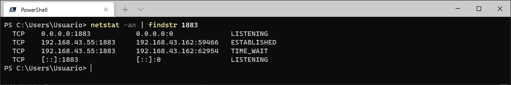
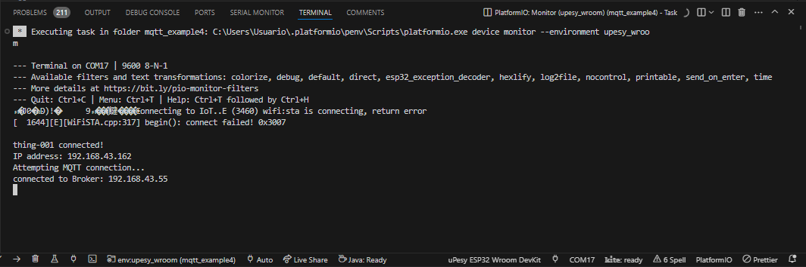
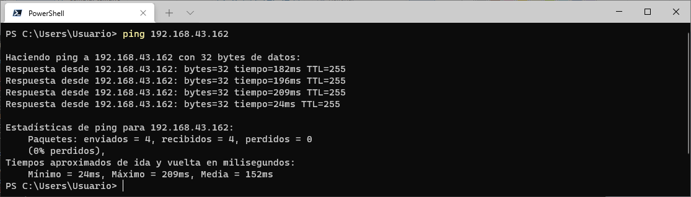
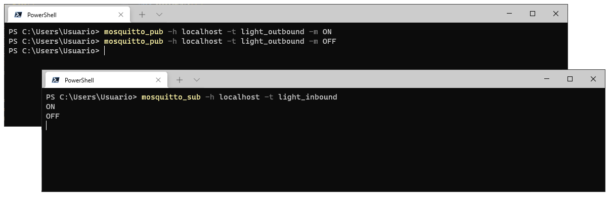
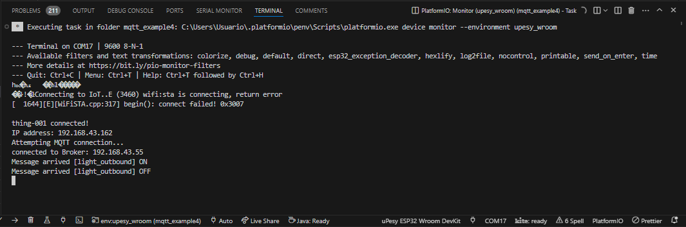

# Ejemplo 4

Realizar una implementación sencilla que permita el encedido y apagado de un led mediante el protocolo MQTT. En la siguiente figura se muestra la aplicación:

<p align = "center">

</p>

Es importante tener en cuenta que antes de realizar cualquier prueba se tiene que probar que el mosquitto este corriendo de tal manera que permita las conexiones de dispositivos externos. La siguiente imagen muestra como hacerlo en una maquina windows usando el comando **`netstat`**:


<p align = "center">

</p>


## Thing - ESP32

### Configuración de la cosa

1. **Hardware**:
   
   * **Lista de componentes**:
  

     |#| Elemento| Cantidad|
     |---|---|---|
     |1|ESP32| 1|
     |1|Resistencia $220 \Omega$| 1|
     |1|Led| 1|

   * **Esquematico**:
  
    <p align = "center">
    
    </p>

   * **Conexión**:
  
    <p align = "center">
    
    </p>


2. **Librerias**:
   
   |#|Libreria|Observaciones|
   |---|---|---|
   |1|PubSubClient|Libreria que implementa el protocolo MQTT|

3. **Parametros WiFi**:

   |Parametro|	Valor|
   |---|---|
   |SSID|`"IoT"`|
   |PASSWORD|`"1245678h"`|

4. **Parametros MQTT**:

   |Parametro|	Valor|
   |---|---|
   |BROKER|`"test.mosquitto.org"`|
   |ID|`"thing-001"`|

5. **Topicos**

   |#|Topico|Mensaje|Descripción|Rol (S/P)|
   |---|---|---|---|---|
   |1|`light_outbound`|`cmd`|`cmd` corresponde al comando recibido para encender (`"ON"`) o apagar  la lampara `"OFF"`.|S|
   |2|`light_inbound`|`cmd`|`cmd` corresponde al comando enviado indicar el estado de la lampara.  Encendida(`"ON"`) o apagada `"OFF"`.|P|
   

6. **Código**:
   
   * **Archivo de configuración**: [platformio.ini](ESP32-code/platformio.ini)
  
        ```ini
        [env:upesy_wroom]
        platform = espressif32
        board = upesy_wroom
        framework = arduino
        lib_deps = knolleary/PubSubClient@^2.8
        ```
    
    * **Header**: [config.h](ESP32-code/src/config.h)
          
        ```h
        #pragma once
        #include <string>
        
        using namespace std;
        
        // ESP32 I/O config
        #define LIGHT_PIN 5
        
        // WiFi credentials
        const char *SSID = "SSID";
        const char *PASSWORD = "PASSWORD";
        
        // MQTT settings
        const string ID = "thing-001";
        
        const string BROKER = "IP_BROKER"; // const string BROKER = "test.mosquito.org";
        const string CLIENT_NAME = ID + "lamp_client";
        
        const string TOPIC1 = "light_outbound";
        const string TOPIC2 = "light_inbound";
        ```
        
    * **Archivo main**: [main.cpp](ESP32-code/src/main.cpp) 

        ```cpp
        #include <Arduino.h>
        #include <WiFi.h>
        #include <PubSubClient.h>
        
        #include "config.h"
        
        WiFiClient espClient;
        PubSubClient client(espClient); // Setup MQTT client
        
        
        // --- ESP32
        
        void setup_ports() {
          pinMode(LIGHT_PIN, OUTPUT); // Configure LIGHT_PIN as an output
        }
        
        
        // ---- Wifi
        
        void connectWiFi() {
          Serial.print("Connecting to ");
          Serial.print(SSID);
          while (WiFi.status() != WL_CONNECTED) {   
            Serial.print(".");
            WiFi.begin(SSID, PASSWORD);
            delay(500);
          }
          Serial.println();
          Serial.print(ID.c_str());
          Serial.println(" connected!");
          Serial.print("IP address: ");
          Serial.println(WiFi.localIP());
        }
        
        // ---- MQTT
        
        
        // Handle incomming messages from the broker
        void clientCallback(char* topic, byte* payload, unsigned int length) {
          String response;
        
          for (int i = 0; i < length; i++) {
            response += (char)payload[i];
          }
          Serial.print("Message arrived [");
          Serial.print(TOPIC1.c_str());
          Serial.print("] ");
          Serial.println(response);
          if(response == "ON")  // Turn the light on
          {
            digitalWrite(LIGHT_PIN, HIGH);
          }
          else if(response == "OFF")  // Turn the light off
          {
            digitalWrite(LIGHT_PIN, LOW);
          }
          // Publish message
          client.publish(TOPIC2.c_str(), response.c_str());
        }
        
        void reconnectMQTTClient() {
          while (!client.connected()) {
            Serial.println("Attempting MQTT connection...");
            if (client.connect(CLIENT_NAME.c_str())) {
              Serial.print("connected to Broker: ");
              Serial.println(BROKER.c_str());
              // Topic(s) subscription
              client.subscribe(TOPIC1.c_str());
            }
            else {
              Serial.print("Retying in 5 seconds - failed, rc=");
              Serial.println(client.state());
              delay(5000);
            }
          }
        }
        
        void createMQTTClient() {
          client.setServer(BROKER.c_str(), 1883);
          client.setCallback(clientCallback);
          reconnectMQTTClient();
        }
        
        void setup() {
          // Setup ports
          setup_ports();
          // Serial setup
          Serial.begin(9600);
          while (!Serial)
            ; // Wait for Serial to be ready
          delay(1000);
          connectWiFi();
          createMQTTClient();
        }
        
        void loop() {
          reconnectMQTTClient();
          client.loop();
          delay(1000);
        }
        ```

###  Prueba mqtt ESP32


La siguiente figura muestra la topologia de prueba. En el caso, el broker y los dos clientes de mosquitto (`mosquitto_pub` y `mosquitto_sub`) corren en el PC, mientras que el otro cliente corre en la ESP32. 

<p align = "center">

</p>


Al conectar el ESP32 al monitor serial, el siguiente resultado:

<p align = "center">

</p>

Es necesario realizar la prueba de conectividad entre el ESP32 y la maquina donde se encuentra el broker. Para esto, se abre una terminal y se ejecuta el comando ping a la IP que se asigno al ESP32 (en el caso la `192.168.43.162`). 

<p align = "center">

</p>

Como se puede ver hay conectividad. De modo que en resumen tenemos las siguientes maquinas en nuestra red:

|Item|Maquina||Aplicaciones|
|---|---|---|---|
|1|PC|`192.168.43.55`|`Broker`, `mosquitto_pub` y `mosquito_sub`|
|2|ESP32|`192.168.43.162`|cliente mosquitto|


La siguiente tabla muestran los comandos aplicados al cliente para encender y apagar la lampara:

|Acción	|Comando mosquitto_pub|
|----|----|
|Encender el led|`mosquitto_pub -h IP_BROKER -t light_outbound -m ON`|
|Apagar el led|	`mosquitto_pub -h IP_BROKER -tlight_outbound -m OFF`|

Para mostrar los mensajes, enviados desde la ESP32, que indican el estado del led se usa el `mosquito_sub`:

```
mosquitto_sub -h IP_BROKER -t light_inbound
```

La siguiente figura muestra el resultado de la ejecución de los comandos anteriores:

<p align = "center">

</p>

Despues de aplicar los comandos anteriores, el resultado en la salida en el monitor serial se muestra a continuación:

<p align = "center">

</p>

Si todo va bien hasta el momento, se debe ver encender y apagar el led conectado a la ESP32 de acuerdo a los comandos que le son enviados.

## Controlando el encendido y apagado del led desde la interfaz kivy

El código de la interfaz se encuentra en el directorio ([link](ejemplo-kivy-iot/)). Esta interfaz envia comandos MQTT para encender y apagar la lampara:

* **Interfaz con el bombillo apagado**:
  
  <p align = "center">
  
  </p>

* **Interfaz con el bombillo encendido**:

  <p align = "center">
  
  </p>


### Prueba MQTT aplicación kivy

<p align = "center">

</p>


## Referencias

* 