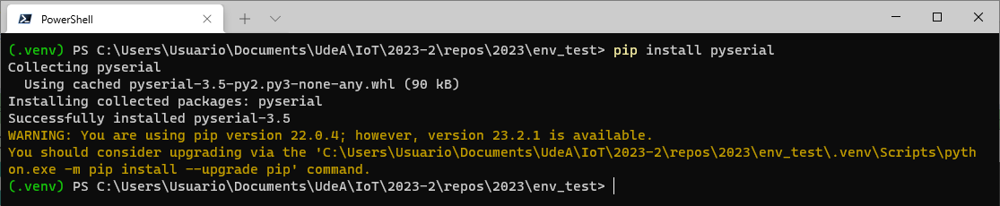

# Creación de un entorno virtual usando python

A continuación se describe el procedimiento para la implementación de un entorno virtual en python con las siguientes librerias:

## Entorno virtual - Primera vez

A continuación se muestra la creación de un entorno virtual:

Requerimientos
* pyserial: ```pip install pyserial```
* fastapi:  ```pip install fastapi```
* univorn:  ```pip install "uvicorn[standard]"```
* kivy: ```pip install "kivy[base]" kivy_examples```

### Caso 1: Primera vez - Desde cero 

Vamos a asumir, para este ejemplo, que el directorio en el cual se encuentra el entorno virtual se llama  **```env_test```** y que para el caso el entorno se va a llamar **venv**. Si es la primera vez que se ejecuta el procedimiento se tiene lo siguiente:

```
mkdir env_test
cd env_test
py -3 -m venv .venv
```

Este proceso se muestra a continuación:


Ahora verificamos que se ha creado el entorno usando el comado **```ls```**:

```
ls
```

El resultado se muestra a continuación:


Posteriormente se activa el entorno:

```
.venv\Scripts\activate
```

Notese que el **prompt** cambia cuando nos entramos dentro del entorno (Ver cuadro amarillo):


Para verificar las librerias que hay instaladas en el entorno se usa el comando **```pip freeze```**:

```
pip freeze
```

El resultado de este se muestra a continuación:


Como se muestra en la figura anterior, el entorno esta limpio de modo que, se procede a realizar la instalación de las librerias necesarias para este caso:

```
pip install pyserial
pip install fastapi
pip install "uvicorn[standard]"
pip install "kivy[base]" kivy_examples
```

En las siguientes capturas se muestra el resultado de la aplicación de cada uno de los comandos anteriormente ejecutados de manera individual:

* **pyserial**: 
  
  

* **fastapi**: 
  
  

* **uvicorn**: 
  
  

* **kivy**: 
  
  

Si se ejecuta de nuevo el comando **```pip freeze```** se podra apreciar que ya se encuentran todas las librerias que necesitamos instaladas:

```
pip freeze
```

El resultado se muestra a continuación:


Luego procedemos a realizar un archivo de backap para que si deseamos realizar un entorno virtual con estos requerimientos no tengamos que empezar desde cero a aplicar los comandos de instalación pip hechos previamente:

```
pip freeze > requirements.txt
```


La siguiente figura muestra el archivo **requirements.txt**


Si todo esta bien, el resultado al final cuando se ejecuta **```ls```** sera como el mostrado en la siguiente figura:


En resumen, se aplicaron anteriormente los siguientes comandos:

```
mkdir env_test
cd env_test
py -3 -m venv .venv
.venv\Scripts\activate
pip install pyserial
pip install fastapi
pip install "uvicorn[standard]"
pip install pydantic
pip install "kivy[base]" kivy_examples
pip freeze > requirements.txt
```

Si todo esta bien, ya tendremos listo el entorno virtual con todas las dependencias necesarias para realizar en python, por lo menos parte de los programas para el curso.

Para salir del entorno virtual ejecutamos el comando **```exit```**:

```
exit
```

Esto hace que la consola se cierre.

### Caso 2: Primera vez - Con archivo requirements.txt

Si ya se tiene el archivo requirements con todos los requerimientos, el procedimiento es mucho mas corto. A continuación se resumen los pasos para ello:

```
mkdir env_test
cd env_test
py -3 -m venv .venv
.venv\Scripts\activate
pip install -r requirements.txt
```

## Entorno virtual existente

Cuando ya existe el entorno virtual con todos los prerequisitos listos, lo unico que tenemos que hacer es activarlo, trabajar y cuando acabemos de hacer todo lo que necesitemos cerrar. Esto se resume a continuación:

1. **Activar el entorno existente**: Se ingresa al directorio donde se encuentra el entorno y se ejecuta el comando de activación:
   
   ```
   cd env_test
   .venv\Scripts\activate
   ```
   
   La siguiente figura muestra el resultado:

   

2. **Codificar el programa en python**: Asumiendo que el firmware de control de la placa ya se descargo, se procede a codificar el programa en python ([serialLedTerminal.py](serialLedTerminal.py)) que interactuara con la placa:
   
   ```
   code serialLedTerminal.py
   ```

   El resultado se muestra a continuación:

   

   Esto abre el Visual Studio Code y se procede a la codificación:

   

   Finalmente se verifica que el archivo se haya guardado en la ruta deseada:

   


3. **Compilar y probar el script**: Se procece a compilar y a probar el el script:
   
   ```
   python serialLedTerminal.py
   ```

   Si todo esta bien; en la terminal, la salida sera como la que se muestra a continuación y en el ESP32, se deberá ver el encendido y apagado del led.

   

4. **Salir**: Cuando ya no se desee trabajar mas, se procede a salirse del entorno virtual usando el comando **```exit```**.

   ```
   exit
   ```
## Anexos

### Script python

**Archivo**: [serialLedTerminal.py](serialLedTerminal.py)

```python
import serial

SERIAL_PORT = 'COM7'
BAUD_RATE = 9600
ser = serial.Serial(port = SERIAL_PORT, baudrate = BAUD_RATE, timeout=.1)

def menu():
    print("Menu de control de la office " )
    print("1. Encender lampara" )
    print("2. Apagar lampara" )
    print("3. Salir de la aplicacion" )    

def lightON():
    ser.write(b'h')

def lightOFF():
    ser.write(b'l')

    
def main():
    print("SISTEMA DE CONTROL DE LA LAMPARA DE LA OFFICE")
    while True:
        menu()
        opc = input("Seleccione una opcion: ")
        if opc == '1':
            print("--> Encendiendo la lampara\n")
            lightON()     
        elif opc == '2':
            print("--> Apagando la lampara\n")
            lightOFF()
        elif opc == '3':
            ser.close()
            print("--> Chao bambino\n")
            break
        else:
            print("--> OPCION INVALIDA\n")

if __name__ == "__main__":
    main()
```

### Archivo ESP32

**Archivo**: [main.cpp](main.cpp)

```ino
#include <Arduino.h>

#define LED 2   // Assign LED to pin GPIO2 (Built-in LED)

byte comando;

void setup() {
  // initialize serial communication at 9600 bits per second:
  Serial.begin(9600);
  Serial.write("Configurando puerto serial a 9600bps\n");
  // initialize digital pin LED as an output.
  pinMode(LED, OUTPUT);
  digitalWrite(LED, LOW);
}

void loop() {
  // check if data has been sent from the computer
  if (Serial.available()) {
    // read the most recent byte 
    comando = Serial.read();
    if(comando == 'h') {
      digitalWrite(LED, HIGH);
      Serial.write("Led encendido\n");
    }
    else if(comando == 'l') {
      digitalWrite(LED, LOW);
      Serial.write("Led apagado\n");
    }
  } 
}
```

## Referencias

* https://www.educative.io/answers/how-to-create-a-dockerfile-for-running-a-python-application
* https://code.visualstudio.com/docs/containers/quickstart-python
* https://www.freecodecamp.org/news/docker-mount-volume-guide-how-to-mount-a-local-directory/
* https://www.losant.com/blog/how-to-access-serial-devices-in-docker
* https://forums.docker.com/t/how-to-expose-host-serial-port-to-container-correctly/81588
* https://github.com/docker/for-win/issues/1018
* https://learn.microsoft.com/en-us/virtualization/windowscontainers/deploy-containers/hardware-devices-in-containers
* https://www.freecodecamp.org/news/python-requirementstxt-explained/
* https://www.jetbrains.com/help/pycharm/managing-dependencies.html
* https://www.jetbrains.com/help/pycharm/managing-dependencies.html#revert-ignored
* https://kivy.org/doc/stable-1.10.1/installation/installation-linuxhtml#installation-in-a-virtual-environment
* https://kivy.org/doc/stable/gettingstarted/installation.html#install-pip
* https://flask.palletsprojects.com/en/2.3.x/installation/#virtual-environments

