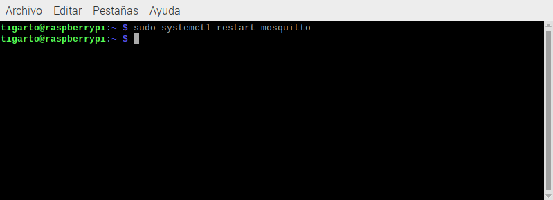
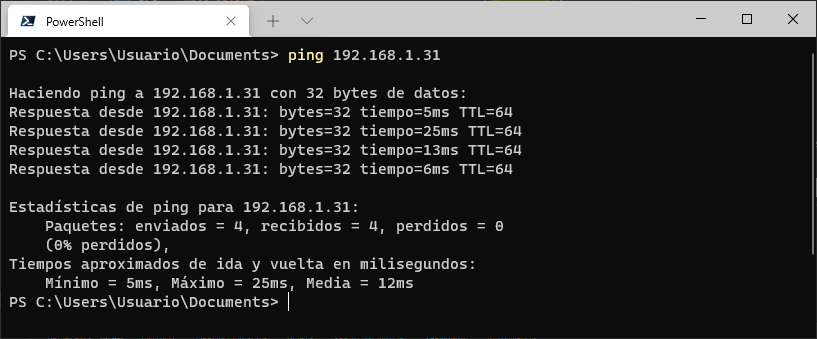

# MQTT

La instalación es indiferente si se hace en un equipo de escritorio o en la Raspberry pi. Para inicializar las cosas vamos a hacer la prueba en el equipo de computo.

## Instalación

1. **Actualizar los paquetes**: Antes de empezar es bueno actualizar la lista de paquetes:
   
   ```
   sudo apt-get update
   ```

2. **Verificar que los paquetes relacionados con el mosquitto se encuentren disponibles**: Verificar que en la lista de paquetes disponibles se encuentren aquellos relacionados con el mosquitto:

   ```
   apt-cache search mosquitto
   ```

   El resultado de la ejecución se muestra a continuación:

   <p align = "center">
   
   </p> 

3. **Instalar el broker MQTT**: Para instalar el broker MQTT se emplea el siguiente comando:
   
   ```
   sudo apt-get install mosquitto
   ```
   
   La salida cuando se ejecuta el comando se muestra a continuación:

   <p align = "center">
   
   </p> 

   Si todo esta bien al final el resultado será similar al siguiente:

   <p align = "center">
   
   </p> 


4. **Instalar los clientes MQTT**: Para instalar los clientes se ejecuta el comando:
   
   ```
   sudo apt-get install mosquitto-clients
   ```

   Tras ejecutar este comando el resultado es como el mostrado en la siguiente figura:

   <p align = "center">
   
   </p> 


### Verificación del funcionamiento del broker

Despues de realizar la instalación del broker, es bueno verificar que este se encuentre en funcionamiento. Esto se puede hacer de varias formas:
1. **Usando el comando `netstat`**: Para tener mayor detalle a la salida se emplea la opción `-tanlp` está asociado a las iniciales de: tcp, all, numeric, listening, program.
   
   ```
   sudo netstat -tanlp | grep 1883
   ```
   
   Para el caso la salida se encuentra a continuación:

   <p align = "center">
   
   </p> 

2. **Usando el comando `ps`**: Se usa el comando `ps` con la opción `-ef` conectandolo con el comando `grep` mediante una tuberia para filtrar la busqueda:
   
   ```
   ps -ef | grep mosquitto
   ```
   
   La salida resultante se muestra a continuación:

   <p align = "center">
   
   </p> 

## Configuración adicional del Broker

A partir de la versión 1.7 mosquitto no permite comunicaciones anónimas. 

Para volver a habilitar esta opción se debe crear un archivo de configuración llamado `standard.conf` dentro del directorio `/etc/mosquitto/conf.d/` con el siguiente contenido:

```
allow_anonymous true
listener 1883
protocol mqtt
```

A continuación se describe el procedimiento:
1. Crear el archivo `/etc/mosquitto/conf.d/standard.conf` usando **vi** o su editor favorito como superusuario:
   
   ```
   sudo vi /etc/mosquitto/conf.d/standard.conf
   ```
   
   A continuación se muestra el comando aplicado en la rPi:

   <p align = "center">
   
   </p> 

2. Editar el archivo recien creado agregando el suguiente contenido:
   
   ```
   allow_anonymous true
   listener 1883
   protocol mqtt
   ```

   Al editar el archivo de configuración usando el **vi** tenemos:

   <p align = "center">
   
   </p> 

3. Guardar los cambios: En el **vi** presionar la tecla `ESC` seguido del comando `:wq` y finalmente `Enter`: 
   
   <p align = "center">
   
   </p> 

4. Verificar que el archivo se haya creado correctamente mediante el comando `cat`: 

   ```
   cat /etc/mosquitto/conf.d/standard.conf
   ```
   
   Si todo esta bien deberá aparecer algo como lo que se muestra a continuación:

   <p align = "center">
   
   </p> 

5. Reiniciar el broker:

   ```
   sudo systemctl mosquitto start
   ```

   El resultado de ejecutar el comando se muestra a continuación:

   <p align = "center">
   
   </p> 


## Verificar la instalación

Finalmente el ultimo paso consiste en verificar que el broker esta funcionando adecuadamente verificando si un cliente puede suscribirse a un topico y si otro cliente puede publicar algun comando sobre este. Para este caso la prueba realizada involucro la rPi (en la cual corre el broker) y un dispositivo externo (PC) desde el cual se publica un mensaje. El topico de prueba es **`test/topic`** y el mensaje enviado es **`Hello, MQTT!`**. A continuación se muestran las caracteristicas de los equipos conectados:

|Equipo|Descripción|IP|
|--|--|--|
|1|Raspberry Pi|192.168.1.31|
|2|PC| 192.168.1.4|

### Raspeberry Pi

1. Abrir una terminal y suscribir un cliente al topico **`test/topic`**:
   
   ```
   mosquitto_sub -t test/topic
   ```

   El resultado se muestra a continuación:

   <p align = "center">
   
   </p> 


2. Abrir otra terminal diferente y publicar el mensaje **`Hello, MQTT!`** al topico **`test/topic`**:
   
   ```
   mosquitto_pub -t test/topic -m "Hello, MQTT!"
   ```
   
   La siguiente figura muestra el resultado:

   <p align = "center">
   
   </p> 

   Si todo esta bien, en la terminal del cliente suscrito (punto 1) deberá aparecer el mensaje recien enviado:

   <p align = "center">
   
   </p> 


### PC

Es importante aclarar que el PC tiene que tener instalado minimamente los clientes de mosquitto. Antes de empezar es necesario verificar que haya comunicación entre el PC (192.168.1.4) y la rPi (192.168.1.31):

```
ping 192.168.1.31
```

Si todo esta bien la salida sera como a siguiente:

   <p align = "center">
   
   </p> 

Luego, desde una terminal en el PC, publicar un mensaje cualquiera (en nuestro caso usamos el mismo) al topico **`test/topic`**. Se debe tener en cuenta que el broker corre en la rPi por lo que la IP (192.168.1.31) de esta se debe pasar en el comando:


```
mosquitto_pub -h 192.168.1.31 -t test/topic -m "Hello, MQTT!"
```

El resultado de aplicar el comando se muestra a continuación:

<p align = "center">

</p> 

Si todo esta bien, en el cliente que esta suscrito al topico **`test/topic`** y que corre en la rPi, deberá aparecer el mensaje acabado de enviar:

<p align = "center">

</p> 

## Referencias

* https://randomnerdtutorials.com/how-to-install-mosquitto-broker-on-raspberry-pi/
* https://raspberry-valley.azurewebsites.net/MQTT-Topic-Trees/
* https://raspberry-valley.azurewebsites.net/MQTT-on-Raspberry-Pi/
* https://raspberry-valley.azurewebsites.net/Map-Bluetooth-Controller-using-Python/
* https://raspberry-valley.azurewebsites.net/Mosquitto/
* https://mosquitto.org/blog/2013/01/mosquitto-debian-repository/
* https://cedalo.com/blog/mqtt-broker-raspberry-pi-installation-guide/
* https://microcontrollerslab.com/install-mosquitto-mqtt-broker-on-raspberry-pi/
* https://www.support.aceautomation.eu/es/knowledge-base/how-to-install-raspberry-pi-os-raspbian-mosquitto-mqtt-broker-on-a-raspberry-pi/
* https://www.tech-sparks.com/install-mosquitto-on-raspberry-pi/
* https://team-ethernet.github.io/guides/How%20to%20install%20and%20use%20Mosquitto%20for%20Windows.pdf
* https://www.luisllamas.es/como-instalar-mosquitto-el-broker-mqtt/
* http://www.steves-internet-guide.com/install-mosquitto-broker/
* https://www.mclibre.org/consultar/documentacion/
* https://www.mclibre.org/
