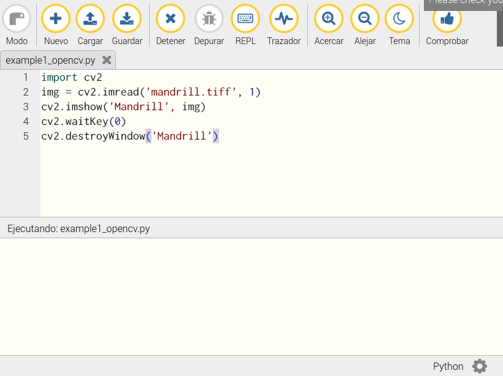
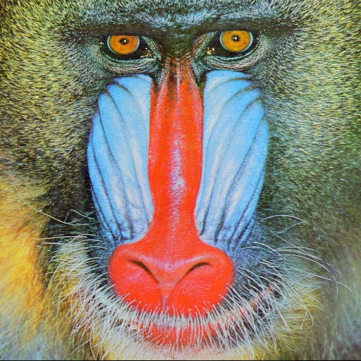
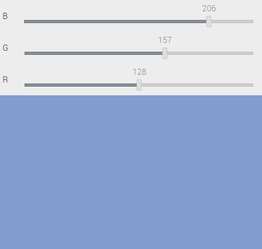

# Open CV

> **Importante**: Estos códigos fueron adaptados del libro...

### Working with images using OpenCV

we will learn to read and store images using the OpenCV API and Python.

* cv2.imread: unction reads an image from the disk and stores it in a NumPy
ndarray.
* cv2.imshow: function displays an image in a window on the screen.
* cv2.waitKey(): function displays an image in a window on the screen. It is the only function in the OpenCV library that can handle the
events of the keyboard. We must call it immediately after the call of the cv2.imshow()
function. If we do not call it that way, no window for the image will be displayed on the
screen as cv2.waitKey() is the only function that fetches and handles events.
* cv2.destroyWindow() function accepts the name of the windows to be destroyed
as an argument.


### Ejemplos 

1. Realizar un programa que despliegue la imagen mostrada a continuación hasta que el usuario presione una tecla que haga que esta se cierre.

<p align = "center">

</p>

   **Solución**: </br> El código [example1_opencv.py](pruebas/intro/example1_opencv.py) se muestra a continuación:

   ```py
   import cv2

   img = cv2.imread('mandrill.tiff', 1)
   cv2.imshow('Mandrill', img)
   cv2.waitKey(0)
   cv2.destroyWindow('Mandrill')
   ```

   En este caso, el programa se codifico en el IDE **mu** tal y como se muestra en la siguiente figura:

   <p align = "center">
   
   </p>


   El resuldado de ejecutar el codigo se muestra la imagen [mandrill.tiff](pruebas/intro/mandrill.tiff) tal y como se muestra a continuación hasta que el usuario presiona una tecla cualquiera:

   <p align = "center">
   
   </p>

2. Mejore el programa anterior de tal manera que cuando el usuario presione la tecla `q`, la imagen mostrada se cierre y cuando presione la tecla `s` la imagen mostrada se guarde como **test.jpg** antes de cerrarla.
   
   **Solución**: </br> El código [example2_opencv.py](pruebas/intro/example2_opencv.py) que hace uso de la imagen [mandrill.tiff](pruebas/intro/mandrill.tiff) para hacer lo que se pide en el enunciado, se muestra a continuación:
   
   ```py
   import cv2

   img = cv2.imread('mandrill.tiff', 1)
   cv2.imshow('Mandrill', img)
   keyPress = cv2.waitKey(0)
   if keyPress == ord('q'):
     cv2.destroyWindow('Mandrill')
   elif keyPress == ord('s'):
     cv2.imwrite('test.jpg', img)
     cv2.destroyWindow('Mandrill')
   ```
   
   La siguiente imagen muestra el resultado tras guardar el archivo.

   <p align = "center">
   
   </p>

3. Usando la libreria matplotlib, muestre una imagen leida como escala de grises.

   **Solución**: </br> El código [example3_opencv.py](pruebas/intro/example3_opencv.py) muestra como se hace:

   ```py
   import cv2
   import matplotlib.pyplot as plt

   img = cv2.imread('mandrill.tiff', 0)
   plt.imshow(img, cmap='gray')
   plt.title('Mandrill')
   plt.axis('off')
   plt.show()
   ```

   Pendiente...

4. Usando OpenCV es posible crear interfaces graficas. En el siguiente ejemplo se muestra una interfaz grafica cuyo color de fondo se puede modificar a travez de unas slides para modificar la composición RGB. La aplicación se cierra cuando el usuario preciona la tecla **Esc** (correspondiente al valor 27).
   
    **Solución**: </br> El código [example4_opencv.py](pruebas/intro/example4_opencv.py) muestra como se hace:


    ```py
    import numpy as np
    import cv2

    def empty(z):
      pass

    image = np.zeros((300, 512, 3), np.uint8)

    cv2.namedWindow('Palette')
    cv2.createTrackbar('B', 'Palette', 0, 255, empty)
    cv2.createTrackbar('G', 'Palette', 0, 255, empty)
    cv2.createTrackbar('R', 'Palette', 0, 255, empty)

    while(True):
      cv2.imshow('Palette', image)
      if cv2.waitKey(1) == 27 :
        break
      blue = cv2.getTrackbarPos('B', 'Palette')
      green = cv2.getTrackbarPos('G', 'Palette')
      red = cv2.getTrackbarPos('R', 'Palette')
      image[:] = [blue, green, red]
    cv2.destroyWindow('Palette')
    ```
 
    La interfaz de usuario resultante se muestra a continuación:

    <p align = "center">
    
    </p>

## Procesamiento de imagen básico

Los ejemplos mostrados a continuación muestran como realizar operaciones aritmeticas y logicas sobre imagenes con NumPy, OpenCV y matplotlib.

### Propiedades basicas

We can retrieve and use many properties, such as the data type, the dimensions, the shape, and the size of bytes of an image with NumPy.

Poner informacion de la imagen

1. Hacer un programa que despliegue la información basica de las propiedades asociadas a una imagen.
   
   ```py
   import cv2
   import matplotlib.pyplot as plt

   img1 = cv2.imread('female1.tiff', 0)
   print(type(img1))
   print(img1.ndim)
   print(img1.shape)
   print(img1.size)
   print(img1.dtype)
   print(img1.nbytes)

   img2 = cv2.imread('female1.tiff', 1)
   print(type(img2))
   print(img2.ndim)
   print(img2.shape)
   print(img2.size)
   print(img2.dtype)
   print(img2.nbytes)
   ```
   
   Nota: Falta correr el codigo y ver el resultado final.

### Operaciones basicas con imagenes

2. Agregan

3. Agregar un borde a una imagen...
   
   ```py
   import cv2

   img = cv2.imread('female1.tiff', 1)
   b1 = cv2.copyMakeBorder(img, 10, 10, 10, 10, cv2.BORDER_WRAP)
   b2 = cv2.copyMakeBorder(img, 10, 10, 10, 10, cv2.BORDER_CONSTANT, value=[255, 0, 0])

   cv2.imshow('Wrap', b1)
   cv2.imshow('Constant', b2)
   cv2.waitKey(0)
   cv2.destroyAllWindows()
   ```

We know that images are nothing but NumPy ndarrays and we can perform arithmetic
operations on images just as we can perform them on ndarrays. If we know how to apply
numerical or arithmetic operations to matrices, then we should not have any trouble
doing the same when the operands for those operations are images

Images must be of
the same size and must have the same number of channels for us to perform arithmetic
operations on them, and these operations are performed on individual pixels. There are
many arithmetic operations, such as addition and subtraction.

4. El siguiente código realiza la operación de sumar sobre dos imagenes.
   
   ```py
   import cv2

   img1 = cv2.imread('mandrill.tiff', 1)
   img2 = cv2.imread('airplane_f16.tiff', 1)

   cv2.imshow('NumPy Addition', img1 + img2 )
   cv2.imshow('OpenCV Addition', cv2.add(img1, img2))
   cv2.waitKey(0)
   cv2.destroyAllWindows()
   ```

5. El siguiente código realiza una resta.

   ```py
   import cv2

   img1 = cv2.imread('mandrill.tiff', 1)
   img2 = cv2.imread('airplane_f16.tiff', 1)

   cv2.imshow('NumPy Subtract', img1 - img2 )
   cv2.imshow('OpenCV Subtract', cv2.subtract(img1, img2))

   cv2.waitKey(0)
   cv2.destroyAllWindows()
   ```

6. Combinación y transición de imagenes
   
   ```py
   import cv2

   img1 = cv2.imread('mandrill.tiff', 1)
   img2 = cv2.imread('airplane_f16.tiff', 1)
   cv2.imshow('Blended Image',
              cv2.addWeighted(img1, 0.5, img2, 0.5, 0))
   cv2.waitKey(0)
   cv2.destroyAllWindows()
   ```

7. Creación de un ejecto de transición de imagenes.
   

   ```py
   import cv2
   import time
   import numpy as np

   img1 = cv2.imread('mandrill.tiff', 1)
   img2 = cv2.imread('airplane_f16.tiff', 1)

   for i in np.linspace(0, 1, 100):
     alpha = i
     beta = 1-alpha
     print('ALPHA =' + str(alpha) + ' BETA =' + str(beta))
     cv2.imshow('Image Transition',
                cv2.addWeighted(img1, alpha, img2, beta, 0))
     time.sleep(0.05)
     if cv2.waitKey(1) == 27 :
       break
   cv2.destroyAllWindows()
   ```

   En construcción...

8. Creación de un ejecto de transición de imagenes.

   ```py
   import cv2
   import time
   import numpy as np

   def emptyFunction():
     pass

   img1 = cv2.imread('mandrill.tiff', 1) 
   img2 = cv2.imread('airplane_f16.tiff', 1)
   output = cv2.addWeighted(img1, 0.5, img2, 0.5, 0)
   windowName = "Transition Demo"
   cv2.namedWindow(windowName)
   cv2.createTrackbar('Alpha', windowName, 0, 
                      1000, emptyFunction)
   while(True):
     cv2.imshow(windowName, output)
     if cv2.waitKey(1) == 27:
       break
     alpha = cv2.getTrackbarPos('Alpha', windowName) / 1000
     beta = 1 - alpha
     output = cv2.addWeighted(img1, alpha, img2, beta, 0)
     print(alpha, beta)
   cv2.destroyAllWindows()
   ```

9. Aca va mas...
    
    ```py
    import cv2

    img1 = cv2.imread('female3.tiff', 1)
    img2 = cv2.imread('house.tiff', 1)
    cv2.imshow('Image1', img1 * 2)
    cv2.waitKey(0)
    cv2.destroyAllWindows()
    ```

10. Aca vamos...
    
    ````py
    import cv2

    img = cv2.imread('peppers.tiff', 0)
    negative = abs(255 - img)
    cv2.imshow('Grayscale', img)
    cv2.imshow('Negative', negative)
    cv2.waitKey(0)
    cv2.destroyAllWindows()
    ```

    Hay que volver a correr este ejemplo (example15)


### Agregando ruido


http://vision.deis.unibo.it/fede/ds-stereo-lab.html

https://sharmaji27.medium.com/how-to-repair-damaged-images-using-inpainting-methods-in-python-using-opencv-339982754137

https://www.geeksforgeeks.org/image-inpainting-using-opencv/


git clone https://github.com/fjean/pymeanshift
cd ~
cd pymeanshift-master/
sudo python3 setup.py build
sudo python3 setup.py install

https://github.com/OmalPerera/Human-detection-system-with-raspberry-Pi/tree/master

https://www.instructables.com/Human-Position-Recognition-With-Camera-and-Raspber/

El proximo ejemplo a probar se muestra a continuación:
* https://github.com/kipr/opencv/tree/master/data
* https://github.com/simonmonk/raspberrypi_cookbook_ed4
* https://github.com/simonmonk/raspberrypi_cookbook_ed4/blob/main/python/ch_08_detect_motion.py
* https://github.com/simonmonk/raspberrypi_cookbook_ed4/blob/main/python/ch_08_faces.py
* https://www.bogotobogo.com/python/OpenCV_Python/python_opencv3_Image_Object_Detection_Face_Detection_Haar_Cascade_Classifiers.php
