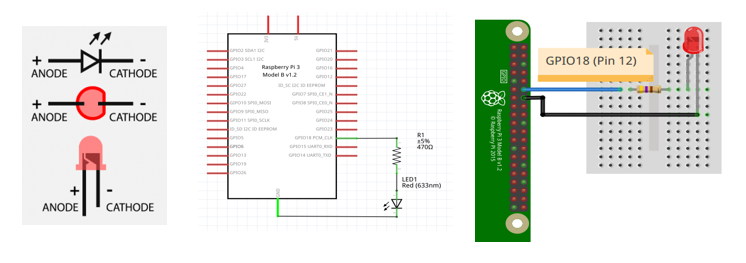

# Ejemplos

## Ejemplos

1. Realizar un programa que haga parpadear un led cada 1 segundo. 
   
   

   
   

2. Realizar un programa imprima en consola "boton presionado" cada vez que se presione el botón, para el caso use una resistencia de pull-up externa. 
   
   

   
   

3. Repita el ejemplo 2 pero sin usar resistencia de pull-up externa.
   
   

   
   

4. Realizar un programa que cambie el estado de un led (de ON → OFF y viceversa) cada vez que se presiona un botón. 
   
   

   
   

5. Hacer un programa que permita ingresar el PWM por teclado (0-100) para ir cambiando la intensidad de un led.

   

   
   
 

## Referencias

* https://gpiozero.readthedocs.io/en/stable/recipes.html
* https://readthedocs.org/projects/gpiozero/downloads/pdf/stable/
* https://www.makeuseof.com/tag/gpio-zero-raspberry-pi/
* https://bennuttall.com/gpio-zero-developing-a-new-friendly-python-api-for-physical-computing/
* https://www.raspberrypi.com/news/gpio-zero-a-friendly-python-api-for-physical-computing/