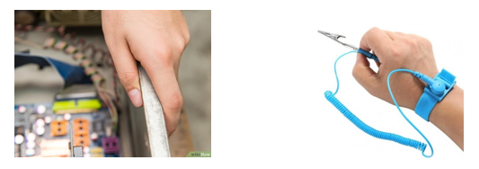
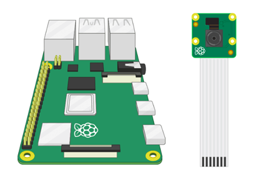
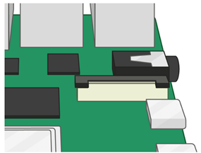
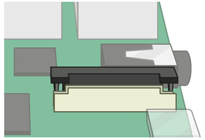
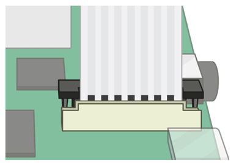
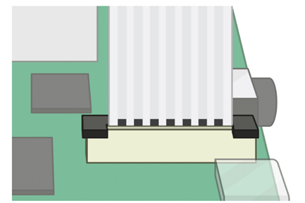
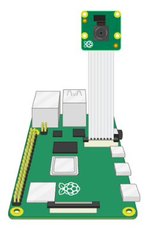
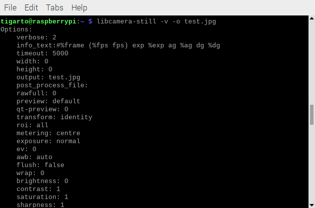
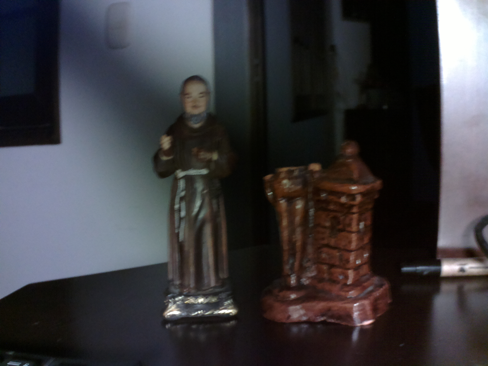
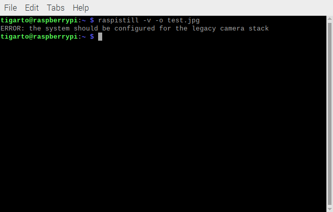

# Camara


## Referencias principales

A continuación se muestran las referencias en las que se basa este documento:
1. **Getting started with the Camera Module** [[link]](https://projects.raspberrypi.org/en/projects/getting-started-with-picamera/0)
2. **Camera - About the Camera Modules** [[link]](https://www.raspberrypi.com/documentation/accessories/camera.html)

## Camaras disponibles

Interfaz CSI

## Primeros pasos

> **Advertencia**
> La cámara es **sensible a la estática** por lo que es necesario tocar una superficie metálica (en caso de no tener una manilla antiestática) antes de manipular la cámara. 
> <p align = "center">
>    
> </p> 

### Elementos


### Conexión de la camara

Para realizar la conexión de la camara, siga los siguientes pasos (**Camera board setup** [[video]](https://www.youtube.com/watch?v=GImeVqHQzsE&t=152s)):

1. Asegúrese que la rPi se encuentra apagada.

<p align = "center">
   
</p> 

2. Localice el puerto al que se conecta la camara.

<p align = "center">
   
</p> 

3. Tire suavemente hacia arriba de los bordes del conector plástico del puerto donde se conecta la cámara.

<p align = "center">
   
</p> 

4. Asegurándose que el cable ribbon de la cámara se encuentre en la dirección correcta, insertelo en el puerto de la RPi destinado a la camara.
   
<p align = "center">
   
</p> 

5. Asegure la conexión física de la cámara empujando el seguro plastico del puerto.

<p align = "center">
   
</p> 

6. Una vez conectada la cámara encienda la rPi.

<p align = "center">
   
</p> 

La siguiente imagen (tomada de **Getting started with the Camera Module** [[link]](https://projects.raspberrypi.org/en/projects/getting-started-with-picamera/0)) resume los pasos anteriormente mostrados:

<p align = "center">
   
</p> 


### Trabajando con la camara

Para habilitar la camara se accede a la consola de configuración mediante el comando:

```bash
sudo raspi-config
```

El procedimiento paso a paso se muestra en el siguiente [link](camera/README.md)

Una vez que se ha realizado el procedimiento anterior, se procede a testear que la cámara está instalada y trabajando, para esto, ejecute el comando:

```bash
libcamera-still -v -o test.jpg
```
El display deberia mostrar un preview por cinco segundos desde la cámara y luego tomar la foto guardando el archivo como **test.jpg** mientras despliega varios mensajes informativos tal y como se muestra en la siguiente imagen.

<p align = "center">
   
</p> 

La imagen capturada (**test.jpg**) se muestra a continuación:

<p align = "center">
   
</p> 

> **¿Que pasa si se usa el comando `raspistill`?**
> Para esta camara en especial, cuando se usa para hacer el test mediante el comando:
>
> ```bash
> raspistill -v -o test.jpg
> ```
>
> El resultado es el siguiente:
> <p align = "center">
>    
> </p> 
>
> Esto se debe a que la versión de la imagen instalada en el sistema es la `Bullseye` (y no la `Buster` para la cual viene instalada por defecto) por lo tanto segun la documentación, si se quiere usar el comando anterior, se debe instalar el **Raspicam driver**.
>
> >**Tip**
> > 
> >Para conocer cual es la versión de la imagen de debian instalada se emplea el comando
> >
> > ```
> > lsb_release -a
> > ```

Si desea usar el driver Raspicam y la versión de la imagen del sistema es la `Bullseye`, este se debe instalar y configurar separadamente tal y como se describe en la documentación ([link](https://www.waveshare.com/wiki/RPi_IR-CUT_Camera#Install_Raspicam_.28Optional.29)). El procedimiento se detalla en el siguiente [link](camera/README.md), sin embargo, si lleva esto a cabo el comando `libcamera-still` dejara de funcionar.  


```bash
sudo apt update
sudo apt upgrade
sudo apt install -y python3-picamera2
```


https://www.waveshare.com/wiki/RPi_IR-CUT_Camera#Preview_Window_Operation

https://github.com/iot-udea/sesiones_magistrales/tree/master/ejemplos_26_08_2019


https://projects-static.raspberrypi.org/projects/getting-started-with-picamera/6ccd55ab3e8a4b995047c27cca0de847629e8eea/en/images/connect-camera.gif


https://www.youtube.com/watch?v=GImeVqHQzsE&t=152s


https://www.youtube.com/watch?time_continue=29&v=E7KPSc_Xr24&embeds_referring_euri=https%3A%2F%2Fprojects.raspberrypi.org%2F&feature=emb_title


## Referencias

* https://www.raspberrypi.com/documentation/accessories/camera.html
* https://projects.raspberrypi.org/en/projects/getting-started-with-picamera
* https://elinux.org/RPi-Cam-Web-Interface
* https://www.raspberrypi.com/documentation/computers/os.html
* https://www.raspberrypi.com/documentation/computers/camera_software.html
* https://docs.arducam.com/Raspberry-Pi-Camera/Native-camera/Libcamera-User-Guide/
* https://www.waveshare.com/wiki/Template:RPi_Camera_Libcamera_Guide
* https://www.raspberrypi.com/news/raspberry-pi-camera-module-still-image-capture/
