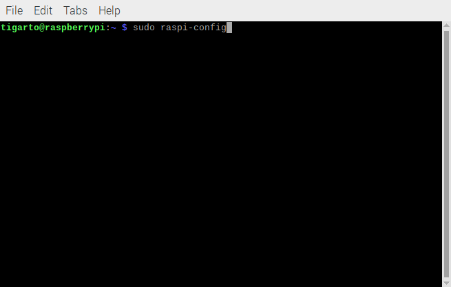
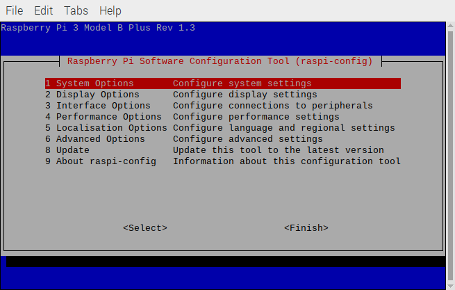
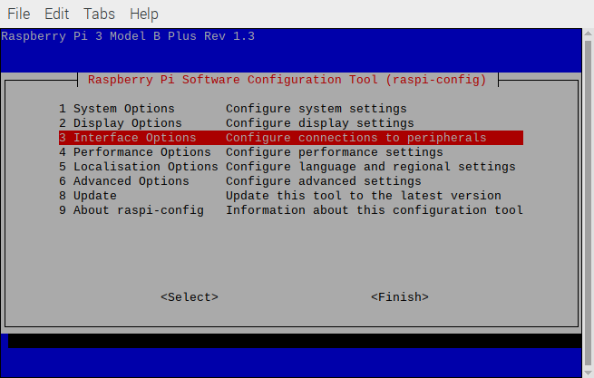
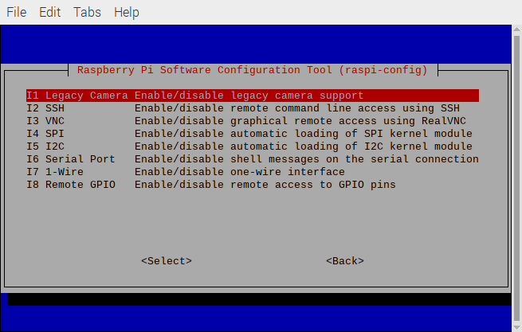
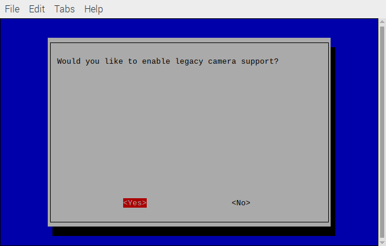
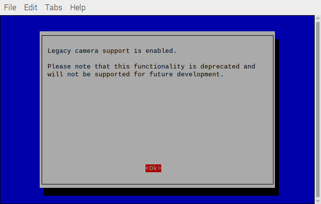
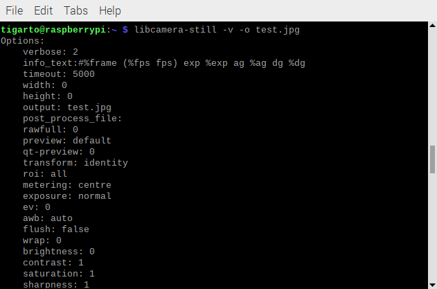
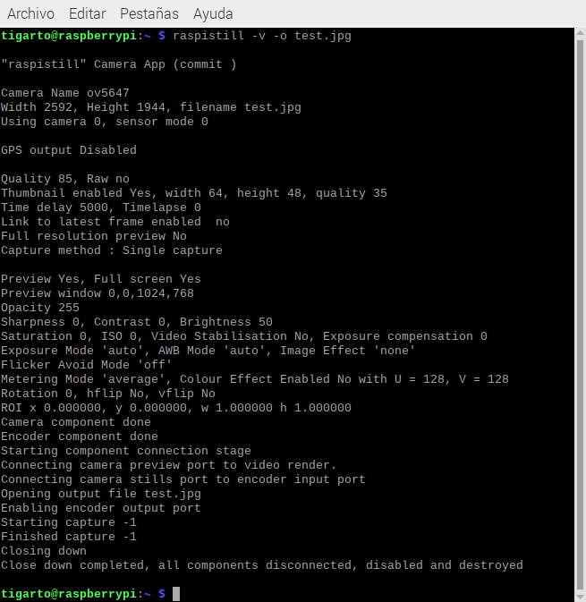
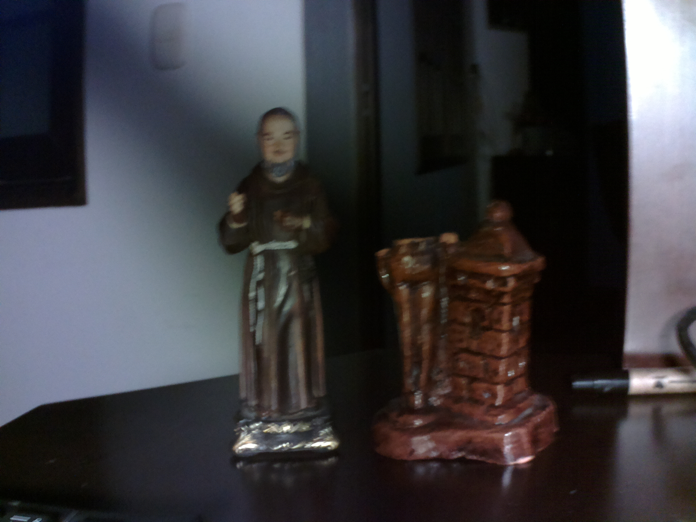
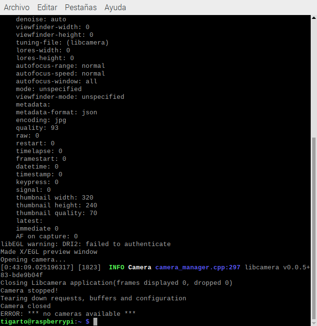

# Camara

## Instalación paso a paso de la camara

> **Importante**
> 
> El proceso que se explica a continuación se resume en el video **Use Picamera with Raspberry Pi OS Bullseye** [[link]](https://www.youtube.com/watch?v=E7KPSc_Xr24&t=29s). Se recomienda que lo vea y replique el procedimiento. 

A continuación se muestran los pasos de configuración de la tarjeta.

1. Acceda al menu de configuración

<p align = "center">
   
</p>

   Si todo estará bien aparecera la siguiente ventana:

<p align = "center">
   
</p> 

3. Acceda la opción **Display Options**

<p align = "center">
   
</p> 

4. Una vez adentro, seleccione la opción **Legacy camera Enable/disable legacy camera support**

<p align = "center">
   
</p> 

5. Habilite el soporte de la camara seleccionando la opción **yes** 

<p align = "center">
   
</p> 

6. Confirme su elección con **Ok**:

<p align = "center">
   
</p> 

## Test de la instalación

Una vez que se ha realizado el procedimiento anterior, se procede a testear que la cámara está instalada y trabajando, para esto, ejecute el comando:

```bash
libcamera-still -v -o test.jpg
```

El display deberia mostrar un preview por cinco segundos desde la cámara y luego tomar la foto guardando el archivo como **test.jpg** mientras despliega varios mensajes informativos tal y como se muestra en la siguiente imagen.

<p align = "center">
   
</p> 


## Instalación de Raspicam (Opcional)

La instalación del driver para la Raspicam se realiza cuando la versión de la imagen es la `Bullseye`, sin embargo, es necesario que esta versión sea de 32 bits. Para saber conocer la versión se emplea el comando:

```bash
uname -m
```

La salida que determina si el sistema operativo es de 32 o 64 bits se muestra en la siguiente tabla:

|Resultado|`Versión del SO|
|---|---|
|`armv7l` o `armv8l`|32 bits|
|`aarch64`|64 bits|

Si el sistema es de 32 bits se procede a ejecutar los siguientes comandos en consola:

```bash
sudo apt-get update
cd
sudo apt install cmake
git clone https://github.com/raspberrypi/userland
cd userland
./buildme
cp build/bin/* ~/bin/
sudo reboot
```

El proceso es un poco demorado así que tenga paciencia. Al final, si todo esta bien podra usar el comando `raspistill` tal y como se muestra en el siguiente comando:

```bash
raspistill -v -o test.jpg
```

Si el procedimiento esta bien, la salida en consola será la mostrada a continuación:

<p align = "center">
   
</p> 

Y la imagen capturada sera almacenada en **test.jpg** tal y como se muestra a continuación:

<p align = "center">
   
</p> 

Sin embargo, la instalación anterior hace que el comando `libcamera-still` deje de funcionar tal y como se muestra en la siguiente imagen:

<p align = "center">
   
</p> 

## ToDo

1. Referencia a los ejemplos usando linea de comandos.
2. Referencia usando scripts de python.
3. Referencia a la instalación usando opencv.