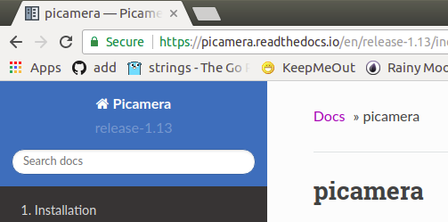
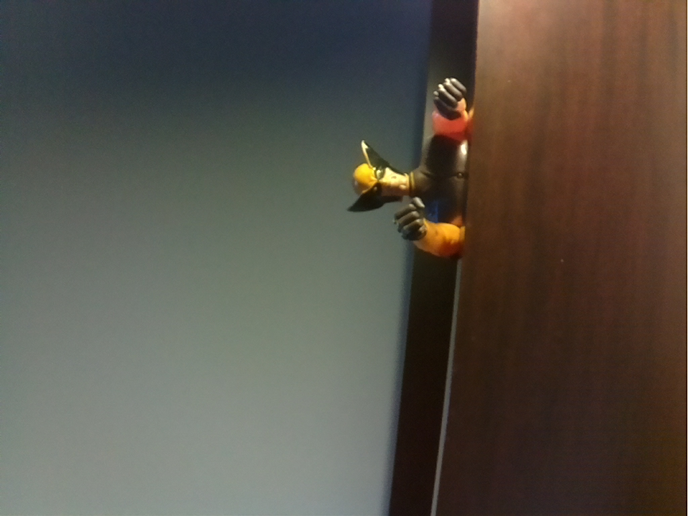
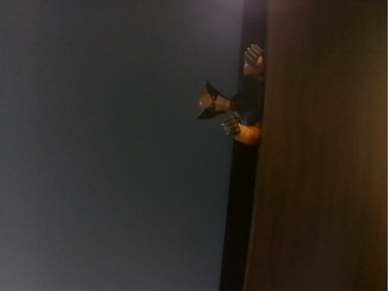
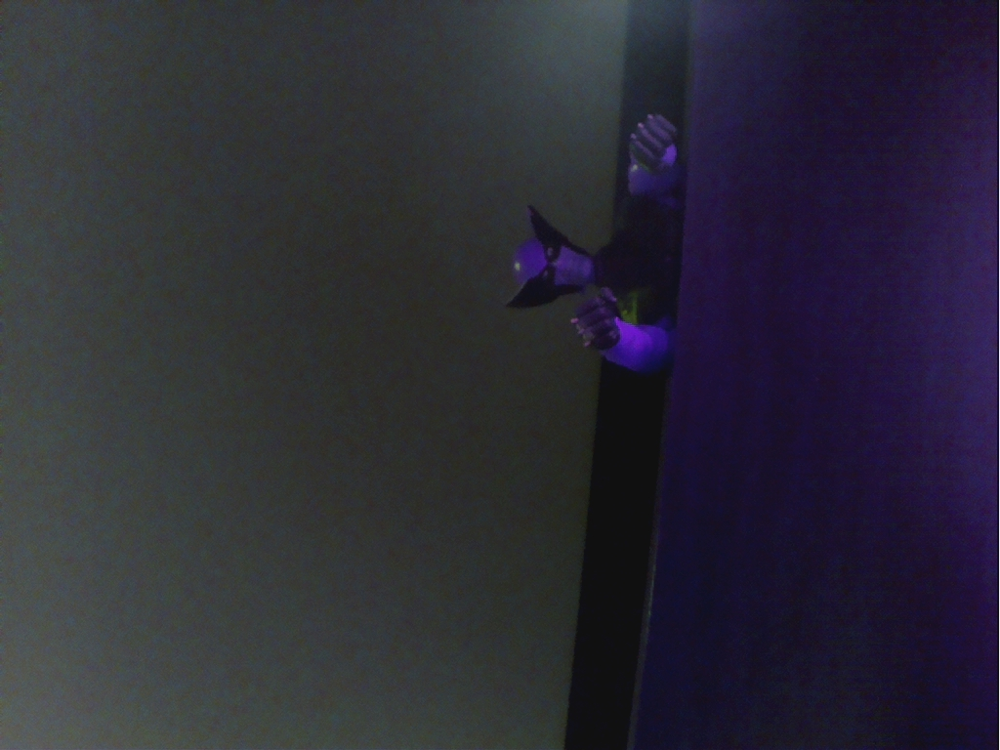
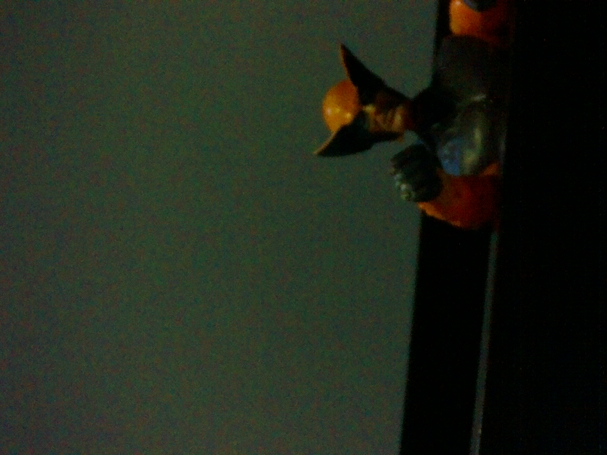
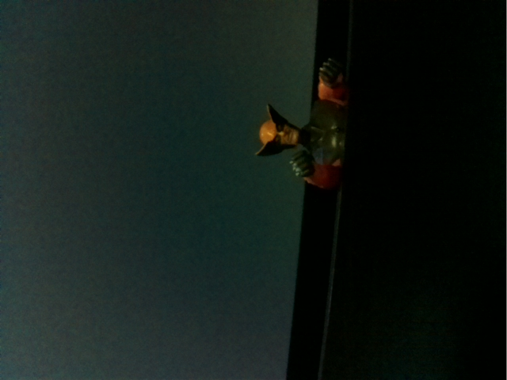
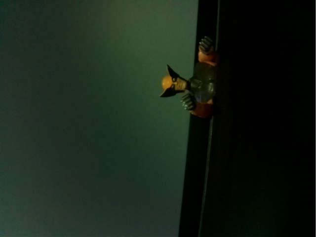
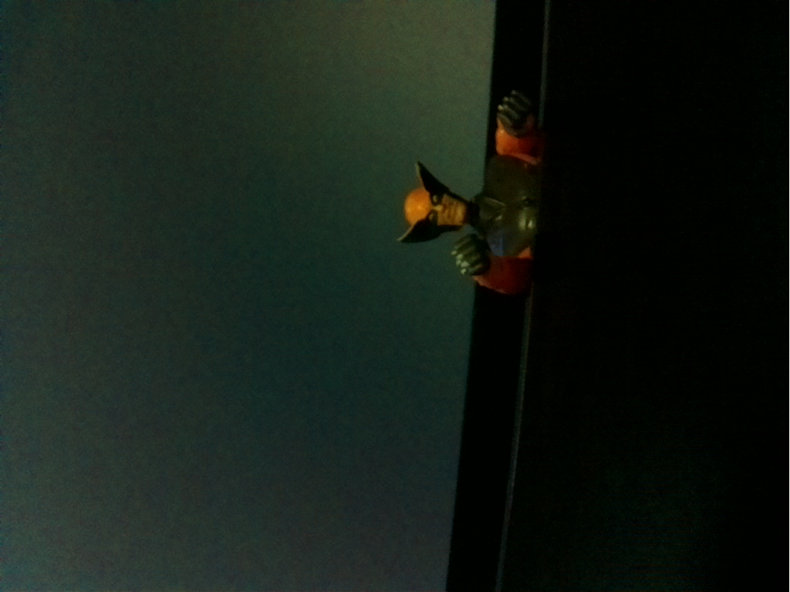
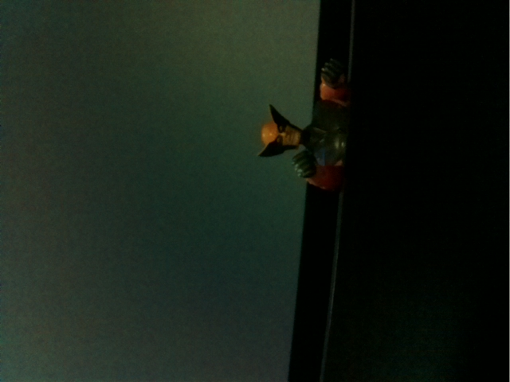

# Script Python

## Instalación


Para controlar la cámara usando python se hace uso de la librería Picamera

```bash
sudo apt update
sudo apt upgrade
sudo apt install -y python3-picamera2
```

## Usando la libreria

El trabajo para hacer uso de la cámara se reduce básicamente a dos cosas principales.
1. Importar la librería.
2. Hacer uso de la clase [PiCamera](https://picamera.readthedocs.io/en/release-1.13/api_camera.html) instanciando un objeto de esta clase y de los diferentes atributos y métodos asociados a esta.

En general existen dos formas para controlar la cámara desde un script de python. En ambas formas lo que se apunta es a cerrar el recurso de la cámara.

### Forma 1

```python
import picamera

camera = PiCamera()
try:
    # do something with the camera
finally:
    camera.close()
```

### Forma 2

```python
import picamera

with PiCamera() as camera:
    # do something with the camera
```

Es importante que tenga siempre a la mano el [API](https://picamera.readthedocs.io/en/release-1.13/index.html) de la Picamera. Entenderlo le servirá no solo para entender los ejemplos de la guia y proyectos muy interesantes, y obviamente para lo más importante, hacer sus creaciones.

<p align = "center">
  
</p>

> **Importante**: 
> 
> Cuando no sea posible la captura de la imagen usando la camara, la recomendación es seguir las instrucciones del siguiente [link](https://raspberrypi.stackexchange.com/questions/75132/unable-to-capture-image-using-the-raspberry-pi-camera-python) 


### Algunos metodos basicos

Para ilustrar estos métodos vamos a suponer que la clase `PiCamera` se instanció como `cam` empleando la siguiente instrucción:

```python
from picamera import PiCamera

cam = PiCamera()
```

Ahora, vamos a proceder a invocar, y a la vez describir, diferentes métodos usando el objeto `cam` recien instanciado:

* Iniciar un preview usando la camara:
  
  ```python
  cam.capture('foto.jpg', use_video_port=True) 
  ```

* Ajustar configuración de la cámara (más ejemplos en el siguiente [enlace](https://projects.raspberrypi.org/en/projects/getting-started-with-picamera/7)):

  
  ```python
  cam.brightness = 50
  cam.sharpness = 0
  ...
  ```

* Iniciar una previsualización de lo que se ve en la cámara:
  
  ```python
  cam.start_preview()
  ```

* Detener la previsualización de lo que se ve en la cámara:
  
  ```python
  cam.stop_preview()
  ```

* Capturar y guardar una imagen:
  
  ```python
  cam.capture('image_name')
  ```

* Liberar cámara:
  
  ```python
  cam.close()
  ```

* Iniciar la grabación de un video:
  
  ```python
  cam.start_recording('video_name')
  ```

* Detener la grabación del video:
  
  ```python
  cam.stop_recording()
  ```

* **Control camera settings**:  A continuación se muestran algunos de los principales settings de la cámara junto con sus valores por defecto y rango de aplicación:
  * `camera.brightness = 50 (0 to 100)`
  * `camera.sharpness = 0 (-100 to 100)`
  * `camera.contrast = 0 (-100 to 100)`
  * `camera.saturation = 0 (-100 to 100)`
  * `camera.iso = 0 (automatic) (100 to 800)`
  * `camera.exposure_compensation = 0 (-25 to 25)`
  * `camera.exposure_mode = 'auto'`
  * `camera.meter_mode = 'average'`
  * `camera.awb_mode = 'auto'`
  * `camera.rotation = 0`
  * `camera.hflip = False`
  * `camera.vflip = False`
  * `camera.crop = (0.0, 0.0, 1.0, 1.0)`

* **Mores Control settings**: 
  * `camera.image_effect = none (the default), negative, solarize, sketch, denoise, emboss, oilpaint, hatch, gpen (graphite sketch effect), pastel, watercolor, film, blur, saturation, colorswap, washedout, posterise, colorpoint, colorbalance, cartoon, deinterlace1, and deinterlace2`
  * `camera.annotate_text`


## Ejemplos

1. Usando la camara grabar video durante 5 segundos.
   
   ```python
   import picamera
   import time
   cam = PiCamera()
   try:
     cam.start_recording('vid.h264')
     sleep(5)
     cam.stop_recording()
   finally:
     cam.close()
   ```

2. Hacer un programa que use la cámara para hacer un preview durante 10 segundos.

   ```python
   from picamera import PiCamera
   from time import sleep
   
   camera = PiCamera()
   try:
     camera.start_preview()
     sleep(10)
     camera.stop_preview()
   finally:
     camera.close() # El close se usa para limpiar recursos
   ```

   > **Nota**: La cámara solo puede hacer previews cuando el
   monitor está conectado a la rPi. Si usted esta usando
   acceso remoto (SSH o VNC) no podrá ver el preview de la
   cámara.
   
3. Hacer un programa que use la cámara para hacer un preview durante 10 segundos. Esta vez haga la operación con with (para que el close sea llamado implícitamente cuando el with se cierre).

   ```python
   from picamera import PiCamera
   from time import sleep
   
   with PiCamera() as camera:
     camera.start_preview()
     sleep(10)
     camera.stop_preview()
   ```

4. Use la cámara para tomar una foto.

   ```python
   from picamera import PiCamera
   from time import sleep
   
   camera = PiCamera()
   try:
     camera.start_preview()
     sleep(5)
     camera.capture('/home/pi/Desktop/image.jpg', use_video_port=True)
     camera.stop_preview()
   finally:
     camera.close()    
   ```
   
   El resultado de la imagen [image.jpg](images/image.jpg) se muestra a continuación:

   <p align = "center">
   
   </p>

   > **Nota**: Es importante hacer un sleep por al menos 2s antes de capturar la imagen ya que esto dara tiempo al sensor de la camara para sensar los niveles de luz.

5. Use la cámara para tomar 5 fotos.

   ```python
   from picamera import PiCamera
   from time import sleep
   
   camera = PiCamera()
   camera.start_preview()
   try: 
     for i in range(5):
       sleep(2)
       camera.capture('/home/tigarto/Documents/image%s.jpg' % i,use_video_port=True)
       camera.stop_preview()
   finally:
     camera.close()        
   ```
      

6. Use la cámara para tomar una foto con resolución de 640 x480.

   ```python
   from picamera import PiCamera
   from time import sleep
   
   with PiCamera() as camera:
       camera.resolution = (640, 480)
       camera.start_preview()
       sleep(5)
       camera.capture('/home/pi/Desktop/image_640x480.jpg',use_video_port=True)
       camera.stop_preview()      
   ```

   El resultado de la imagen [image_640x480.jpg](images/image_640x480.jpg) se muestra a continuación:

   <p align = "center">
   
   </p>

7. Use la cámara para capturar una fotografia empleando el efecto colorswap

   ```python
   import time
   import picamera

   with picamera.PiCamera() as camera:
     camera.start_preview()
     camera.image_effect = 'colorswap'
     time.sleep(5)
     camera.capture('/home/tigarto/Desktop/colorswap.jpg', use_video_port=True)
     camera.stop_preview()
   ```

   La imagen [colorswap.jpg](images/colorswap.jpg) resultante se muestra a continuación:

   <p align = "center">
   
   </p>

8. Capture una fotografia modificando varios de los parametros de control de la camara.
   
   ```python
   import time
   import picamera

   with picamera.PiCamera() as camera:
     camera.resolution = (1280, 720)
     camera.start_preview()
     camera.exposure_compensation = 2
     camera.exposure_mode = 'spotlight'
     camera.meter_mode = 'matrix'
     camera.image_effect = 'gpen'
     # Give the camera some time to adjust to conditions
     time.sleep(2)
     camera.capture('foo.jpg', use_video_port=True)
     camera.stop_preview()
   ```
   
   La imagen [foo.png](images/foo.jpg) se muestra a continuación:

   <p align = "center">
   
   </p>

9. Escriba un script que permita hacer una previsualización de una imagen conforme se varia el brillo en la camara.

   ```python
   import time
   import picamera

   with picamera.PiCamera() as camera:
     camera.start_preview()
     try:
       for i in range(100):
         camera.brightness = i
         time.sleep(0.2)
     finally:
       camera.stop_preview()
   ```
   
10. Use la cámara para hacer una previsualización en pantalla de los diferentes efectos que posee la cámara.

   ```python
   from picamera import PiCamera
   from time import sleep

   with PiCamera() as pycam:
     pycam.start_preview()
     for effect in pycam.IMAGE_EFFECTS:
       pycam.image_effect = effect
       pycam.annotate_text = "Effect: %s" % effect
       sleep(5)
     pycam.stop_preview()
   ```
11. Tome una fotografía usando exif tags.
    
    ```python
    import time
    import picamera

    with picamera.PiCamera() as camera:
      camera.resolution = (2592, 1944)
      camera.start_preview()
      time.sleep(2)
      camera.exif_tags['IFD0.Artist'] = 'Me!'
      camera.exif_tags['IFD0.Copyright'] = 'Copyright (c) 2013 Me!'
      camera.capture('foo2.jpg',use_video_port=True)
      camera.stop_preview()
    ```

    La imagen [foo2.png](images/foo2.jpg) resultante se muestra a continuación:

    <p align = "center">
    
    </p> 

12. Use la cámara para hacer una captura continua (forma 1) de cinco imágenes, tomando cada imagen cada 2 segundos.
    
    **Forma 1**:

    ```python
    import time
    import picamera

    camera = picamera.PiCamera()
    try:
      camera.resolution = (640, 480)
      camera.start_preview()
      time.sleep(1)
      num_capturas = 5
      for i, filename in enumerate(camera.capture_continuous('image_num{counter:02d}.jpg',use_video_port=True)):
        print('Captured image %s' % filename)
        if i == num_capturas - 1:
          break
        time.sleep(2)
        camera.stop_preview()
    except:
      camera.close()
    ```
    
    Por ejemplo, una de las cinco imagenes capturadas ([image_num01.jpg](images/image_num01.jpg)) se muestra a continuación:

    <p align = "center">
    
    </p> 

    **Forma 2**:
    
    ```python
    import time
    import picamera

    with picamera.PiCamera() as camera:
      camera.resolution = (640, 480)
      camera.start_preview()
      time.sleep(1)
      num_capturas = 5
      for i, filename in enumerate(camera.capture_continuous('image2_num{counter:02d}.jpg',use_video_port=True)):
        print('Captured image %s' % filename)
        if i == num_capturas - 1: 
          break
        time.sleep(2)
      camera.stop_preview()
    ```

    A continuación se muestra la imagen [image2_num05.jpg](images/image2_num05.jpg):  

    <p align = "center">
    
    </p> 


13. Use la cámara para hacer una captura secuencia de una secuencia de 4 fotos.

    ```python
    import time
    import picamera

    with picamera.PiCamera() as camera:
      camera.start_preview()
      time.sleep(2)
      camera.capture_sequence([
        'sec_image1.jpg',
        'sec_image2.jpg',
        'sec_image3.jpg',
        'sec_image4.jpg'
        ], use_video_port=True)
      camera.stop_preview()
    ``` 

    La ultima de las imagenes resultantes ([sec_image4.jpg](images/sec_image4.jpg)) se muestra a continuación:

    <p align = "center">
    
    </p> 

14. Use la cámara para hacer una captura secuencia de 120 fotos. Mida el tiempo que se demora la captura de las fotos.
    
    ```python
    import time
    import picamera

    with picamera.PiCamera() as camera:
      camera.resolution = (640, 480)
      camera.start_preview()
      start = time.time()
      camera.capture_sequence((
        'sec2_image%03d.jpg' % i
        for i in range(120)
        ), use_video_port=True)
      print('Captured 120 images at %.2ffps' % (120 / (time.time() - start)))
      camera.stop_preview()
    ```
    
    La ultima de las imagenes ([sec2_image119.jpg](images/sec2_image119.jpg)) de la secuencia se muestra a continuación:

    <p align = "center">
    
    </p> 


Para profundizar mas puede encontrar mas ejemplos en el capitulo **Basic Recipes** ([enlace](https://picamera.readthedocs.io/en/release-1.13/recipes1.html)) de la documentación de la picamera ([link](https://picamera.readthedocs.io/en/release-1.13/index.html)) 


## ToDo

* Poner referncias a los ejemplos de la guia con la versión2...
  * https://datasheets.raspberrypi.com/camera/picamera2-manual.pdf
  * https://picamera.readthedocs.io/en/release-1.13/index.html
  * https://docs.arducam.com/Raspberry-Pi-Camera/Native-camera/PiCamera2-User-Guide/

## Referencias

* https://datasheets.raspberrypi.com/camera/picamera2-manual.pdf
* https://picamera.readthedocs.io/en/release-1.13/index.html
* https://docs.arducam.com/Raspberry-Pi-Camera/Native-camera/PiCamera2-User-Guide/
* https://iotdesignpro.com/projects/iot-based-smart-wifi-doorbell-using-raspberry-pi-and-picamera
* https://iotdesignpro.com/projects/telegram-controlled-home-automation-using-raspberry-pi
* https://github.com/FutureSharks/rpi-security
* https://jackbarker.com.au/photo-booth/
* https://www.hackster.io/ujur007/raspberry-pi-home-security-system-with-camera-and-pir-sensor-6154f3
* https://circuitdigest.com/microcontroller-projects/raspberry-pi-iot-intruder-alert-system
* https://www.hackster.io/wia/security-system-w-motion-sensor-camera-wia-raspberry-pi-07e15e
* https://www.meccanismocomplesso.org/en/picamera-python-programming-a-webcam-on-raspberry-pi/