# kivy rPi


## Instalación de Kivy en la Raspberry pi 4 - Bullseye y Buster

> **Importante** <br>
> Para conocer mas sobre el proceso puede consultar el proceso en la documentación oficial la sección **Raspberry Pi OS Buster/Bullseye/Bookworm** ([link](https://kivy.org/doc/stable/installation/installation-rpi.html#install-source-rpi)).


Para llevar a cabo la instalación de kivy en la rPi, siga el siguiente procedimiento:

1. Instalar Python desde el administrador de paquetes:
   
   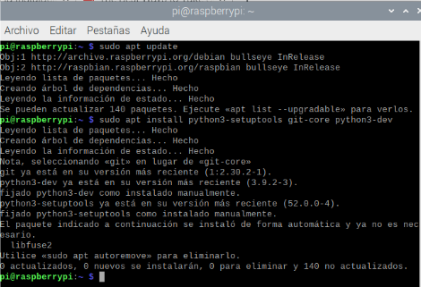

   Como se pude observar en la figura anterior, en el sistema ya se encontraba todo instalado.

2. Instalar dependencias:


   ```bash
   sudo apt update
   sudo apt install pkg-config libgl1-mesa-dev libgles2-mesa-dev \
   libgstreamer1.0-dev \
   gstreamer1.0-plugins-{bad,base,good,ugly} \
   gstreamer1.0-{omx,alsa} libmtdev-dev \
   xclip xsel libjpeg-dev
   ```
   En la siguiente figura muestra la aplicación del comando en la rPi:

   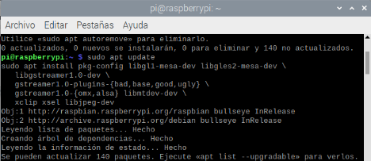

   Si todo esta bien, el resultado de ejecutar la instalación de las dependencias arrojará un resultado similar al siguiente:

   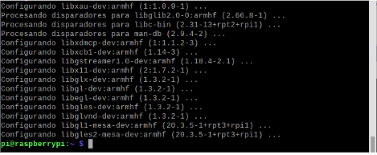

3. Instalar SDL2 desde apt:
   
   ```bash
   sudo apt install libsdl2-dev libsdl2-image-dev libsdl2-mixer-dev libsdl2-ttf-dev
   ```
   
   Al aplicar el comando anterior tenemos:
   
   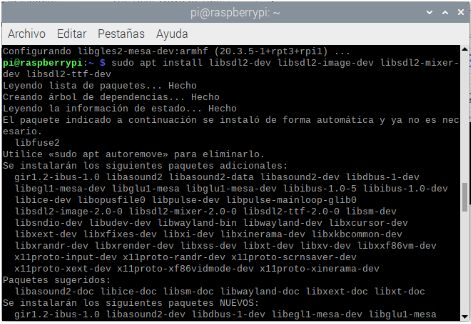

   Si todo sale segun lo esperado el resultado sera como el siguiente:
   
   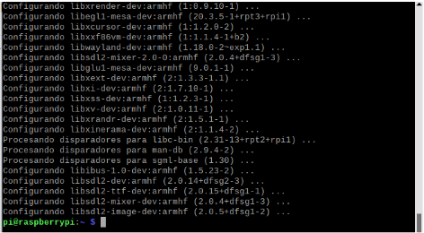

4. **Actualización de paquetes pip**: Antes de instalar Kivy, es necesario instalar Python y pip. Inicie una nueva terminal que tenga Python disponible. En la terminal, actualice pip y otras dependencias de instalación para que tenga la última versión de la siguiente manera (para los usuarios de Linux, es posible que deba sustituir python3 en lugar de python y también agregar un indicador de usuario en los comandos posteriores fuera del entorno virtual):
   
   ```bash
   python -m pip install --upgrade pip setuptools virtualenv
   ```

   En buster:

   ```bash
   python3 -m pip install --upgrade pip setuptools virtualenv
   ```

   El procedimiento de ejecutar el comando se muestra en la siguiente figura:

   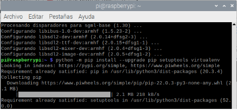

   Los resultados se muestran a continuación:
   
   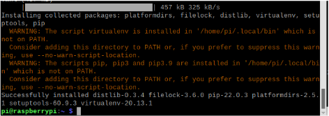

5. **Crear un ambiente virtual para la instalación de Kivy**: Al crear este ambiente se previene el posible surgimiento de conflictos entre paquetes de python.
   
   ```bash
   python -m virtualenv kivy_venv
   ```

   A continuación se muestra el proceso:

   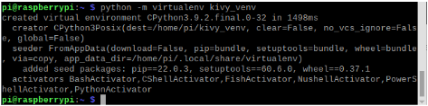

6. **Active el ambiente virtual de python que se acaba de crear**:
   
   ```
   source kivy_venv/bin/activate
   ```
   
   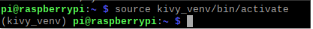

7. **Instalar kivy usando las Wheels precompiladas**
   
   
   ```bash
   python -m pip install kivy[full] kivy_examples
   ```

   En buster:

   ```bash
   python3 -m pip install kivy[full] kivy_examples
   ```

   A continuación se muestran los resultados de aplicar el comando anterior:

   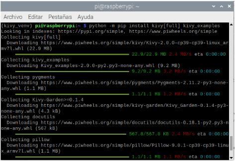

   Listo! Eso es todo lo necesario para la instalación de este paquete.

## Test de la instalación

Para probar que la instalación este correcta vamos a ejecutar varios ejemplos precompilados de kivy:

* **Test 1**: Ejecución una Demo que invoca los varios ejemplos de uso de los diferentes widgets de kivy:
  
  ```bash
  python kivy_venv/share/kivy-examples/demo/showcase/main.py
  ```

  Al ejecutar el comando tenemos:

  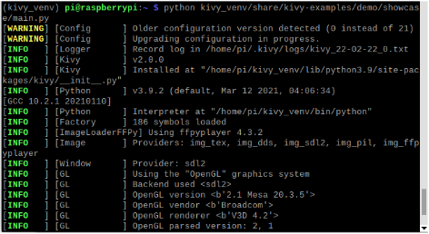

  Esto llama la siguiente interfaz grafica:

  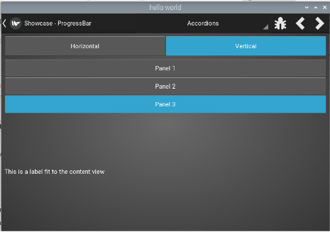

* **Test 2**: Ejecutemos un ejemplo 3D:
  
  ```bash
  python kivy_venv/share/kivy-examples/3Drendering/main.py
  ```
  
  El resultado se muestra a continuación:

  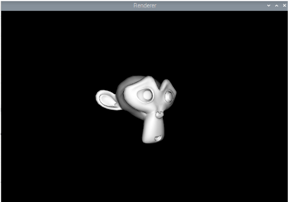


## Ejemplos

Ejemplo 1 (https://github.com/UdeA-IoT/tutorial-kivy).

